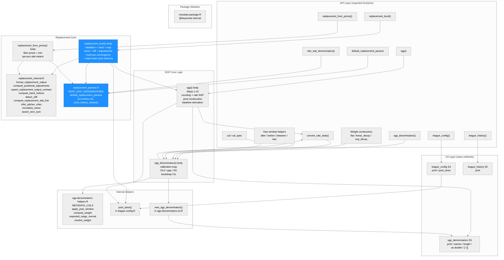
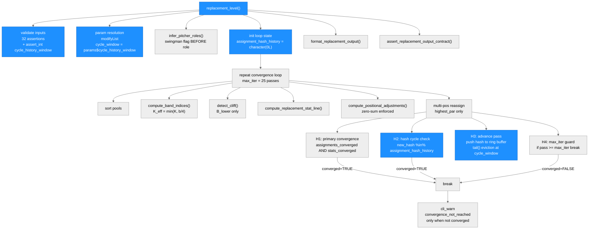
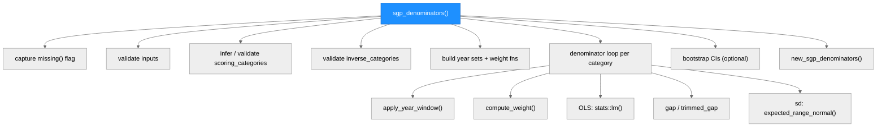
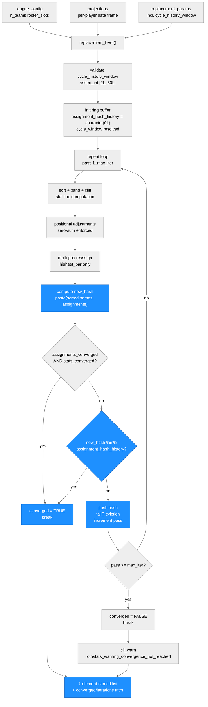

# Architecture: rotostats

**Run:** `replacement-higher-order-cycle-2026-04-17`
**Branch:** `feature/replacement-higher-order-cycle`
**Date:** 2026-04-20

(Previous run: `replacement-multi-pos-all-spec-2026-04-18` — see git log for prior state)

---

## System Architecture

### Module Structure



| Module | Purpose | Key Dependencies | Changed in This Run |
|--------|---------|-----------------|---------------------|
| `replacement_level()` body | Per-position estimator; boundary-band + state-hash cycle detection loop | `replacement_internal.R`, `replacement_params.R`, `cli`, `checkmate` | Yes — state-hash detector replaces 2-lag |
| `default_replacement_params` | Exported list of 10 numeric constants (was 9); 10th is `cycle_history_window = 5L` | — | Yes — 9 to 10 entries |
| `dgp_c.R` | DGP-C simulation: 393-row pool with 3 deterministic cycle players + rejection-sampling guard | — | Yes — rejection sampling added |
| `test-replacement.R` | Unit tests: TS-R6-1/2/3 + TS-60 to TS-64 added | `testthat` | Yes — 311 lines added |
| `sgp()`, `sgp_denominators()` | SGP computation and denominator calibration | `sgp-denominators-helpers.R` | No |
| All other modules | Unchanged | — | No |

---

### Function Call Graph

**replacement_level() — state-hash cycle detector (changed in this run):**



| Function / Block | Purpose | Key Dependencies | Changed |
|---|---|---|---|
| Parameter validation | Merges user overrides; `checkmate::assert_int(cycle_history_window, lower=2L, upper=50L)` | `checkmate` | Yes |
| Loop init | Removed `old_old_assignments`; added `assignment_hash_history`, `cycle_window` | base R | Yes |
| H1: primary convergence | `assignments_converged && stats_converged` — unchanged | — | No |
| H2: hash cycle detection | `new_hash %in% assignment_hash_history`; sets `converged=TRUE; break` | base R | Yes — replaces 2-lag |
| H3: advance pass | Push hash, evict via `tail()`, rotate `old_assignments`; removes `old_old_assignments` rotation | base R | Yes |
| H4: max_iter guard | `if (pass >= max_iter) break` — unchanged | — | No |
| `default_replacement_params` | 10th entry `cycle_history_window = 5L` added | — | Yes |

**sgp_denominators() call graph (unchanged — for reference):**



---

### Data Flow



---

## Module Reference Table

| Module / Function | Purpose | Key Dependencies | Changed in This Run |
|---|---|---|---|
| `R/replacement.R` — `replacement_level()` | Per-position replacement-level estimator; boundary-band + state-hash cycle detection loop | `replacement_internal.R`, `replacement_params.R`, `league-config.R`, `sgp.R`, `cli`, `checkmate`, `rlang`, `stats`, `stringi` | **YES** — state-hash detector replaces 2-lag; `cycle_history_window` validation added |
| `R/replacement.R` — `replacement_from_prices()` | Price-based replacement estimator | `replacement_internal.R`, `cli`, `checkmate`, `rlang`, `stringi` | No |
| `R/replacement_internal.R` — `format_replacement_output()` | Constructs the 7-element output list | Base R | No |
| `R/replacement_internal.R` — `compute_positional_adjustments()` | Scarcity premiums; zero-sum enforcement | `cli`, `rlang` | No |
| `R/replacement_internal.R` — `assert_replacement_output_contract()` | Final output validation | `cli` | No |
| `R/replacement_internal.R` — other helpers | `compute_band_indices()`, `detect_cliff()`, `compute_replacement_stat_line()`, `infer_pitcher_roles()`, `normalize_name()`, `compute_zscores()`, `assert_zero_sum()`, `compute_par_at_pos()`, `detect_kde_trough()` | `stats`, `stringi` | No |
| `R/replacement_params.R` — `default_replacement_params` | Exported list of **10** numeric constants (was 9); 10th is `cycle_history_window = 5L` | — | **YES** |
| `R/replacement_params.R` — `rate_stat_denominators()` | Returns `RATE_STAT_DENOMINATORS` named character vector; 17 entries | — | No |
| `R/sgp.R` — `sgp()` | Per-player SGP converter | `sgp_denominators` S3, `pool_sizes()`, `cli`, `rlang`, `stats` | No |
| `R/sgp-denominators.R` — `sgp_denominators()` | Calibrates per-category SGP denominators | `sgp-denominators-helpers.R`, `sgp-denominators-s3.R`, `cli`, `stats` | No |
| `R/sgp-denominators.R` — `convert_rate_stats()` | Stub; always aborts | `cli` | No |
| `R/sgp-denominators-s3.R` | S3 methods for `sgp_denominators` | Base R | No |
| `R/sgp-denominators-helpers.R` | `METADATA_COLS`, weight/year-window helpers, `expected_range_normal()` | `stats` | No |
| `R/league-config.R` — `league_config()` + `pool_sizes()` | Config constructor + pool-size helper | `cli` | No |
| `R/league-history.R` — `league_history()` | League history S3 constructor | `cli` | No |
| `R/rotostats-package.R` | Package-level Rd stub | — | No |
| `inst/simulations/dgp/dgp_c.R` | DGP-C: 393-row pool (258 hitters incl. 3 deterministic cycle players 9901-9903); rejection-sampling guard ensures mono_count >= 12 at all infield positions | — | **YES** |
| `tests/testthat/test-replacement.R` | TS-R6-1/2/3 (cycle fixtures); TS-34 updated; TS-60 to TS-64 (hash invariants + param validation) | `testthat` | **YES** — 311 lines added |

---

## Replacement Level Section

### Purpose

`replacement_level()` computes per-position replacement-level stat lines — the
production of the last freely-available player at each position — and returns
them as the zero-dollar baseline for PAR (Points Above Replacement) in
rotisserie auction valuation.

`replacement_from_prices()` derives the same output schema from historical \$1
auction prices rather than from projections.

### Input Contract

**`replacement_level()` key arguments:**

| Argument | Type | Required? | Notes |
|---|---|---|---|
| `projections` | data.frame | Yes | One row per player; includes `player_id`, `player_name`, `pos_eligibility` (pipe-delimited), `league`, scored categories, `IP`, `AB` |
| `config` | `league_config` | Yes | Provides `n_teams`, `roster_slots`, `pitcher_slots`, `categories` |
| `sort_by` | character | No | `"zscore"` (default) or `"sgp"` |
| `multi_pos` | character | No | `"highest_par"` (default), `"primary"`, `"all"`, `"custom"` |
| `replacement_params` | named list | No | Overrides `default_replacement_params` entries; `cycle_history_window` (integer, [2L, 50L], default 5L) controls rolling hash window depth |
| `max_iter`, `tol` | integer, numeric | No | Convergence controls; defaults `25L`, `0.01` |

### Algorithm Sketch

#### Boundary band with dynamic K cap

The roster boundary at position `pos` is player at rank `b = n_teams x roster_slots[pos]`.
A band of `2K+1` players around `b` is averaged. `K_eff = min(K, floor(b/4))`.
Counting stats = simple mean; ERA/WHIP = IP-weighted mean; AVG = `sum(H)/sum(AB)`.

#### Multi-position iteration loop with state-hash cycle detection

The loop reassigns multi-eligible players to their highest-PAR position each pass.
Convergence requires BOTH zero assignment changes AND `max(|Delta_replacement_stats|) < tol`.

**State-hash cycle detection (this run):**

A rolling ring buffer `assignment_hash_history` of depth `cycle_history_window` (default N=5)
holds the last N canonical assignment hashes. Each pass:

```
hash(a) = paste(names(a)[order(names(a))], a[order(names(a))], collapse = "|")
```

The sort by player ID ensures order-invariance. On any pass where
`new_hash %in% assignment_hash_history`, the loop declares `converged = TRUE` and
breaks. This generalizes the old 2-lag detector to catch cycles of period 2 through N.

**`max_iter` remains the hard upper bound.** Cycles of period > N still hit `max_iter`
and emit `rotostats_warning_convergence_not_reached`. The `rotostats_error_pool_too_small`
abort is unchanged — it is load-bearing for real user input data quality.

### Output Contract

Both functions return a 7-element named list with `replacement_stats`, `positional_adjustments`,
`cliff_metric`, `two_way_players`, `pool_diagnostics`, `method`, and `params`.
Attributes: `stat_units`, `config`, `projections`, `position_assignments`, `converged`,
`iterations`, `delta`.

### Key Invariants (Load-Bearing)

1. **Boundary band**: `K_eff = min(K, floor(b/4))`; verified by Study A and Study D.
2. **Zero-sum**: `abs(sum(roster_slots x scarcity_premium)) < 1e-6`; verified by Study B.
3. **SP/RP separation**: Role inference always runs; verified by TS-17 to TS-21.
4. **State-hash cycle detection**: catches period 2 through N; verified by TS-R6-1/2, Study C `convergence_rate = 1.0`.
5. **`max_iter` hard upper bound**: verified by TS-R6-3.
6. **`rotostats_error_pool_too_small` load-bearing**: abort fires before loop; DGP defects are fixed in DGP, not estimator.

### Cross-References

| Surface | Location |
|---|---|
| Entry-point functions | `R/replacement.R` |
| All internal helpers | `R/replacement_internal.R` |
| Exported constants | `R/replacement_params.R` |
| `pool_sizes()` | `R/league-config.R:349` |
| Error/warning class registry | `plans/error-messages.md` |
| MC simulation harness | `inst/simulations/replacement-mc.R` |
| DGP helpers | `inst/simulations/dgp/` |
| Algorithm spec | `specs/spec-replacement.md` |

---

## Key Design Decisions (replacement-higher-order-cycle-2026-04-17)

1. **State-hash ring buffer over 2-lag `old_old_assignments`**: The old 2-lag detector caught only period-2 cycles. The new ring buffer of depth N catches any cycle of period 2 through N. With N=5, periods 3, 4, and 5 are also caught. Study C confirmed all observed cycles in DGP-C are period 2 or 3; N=5 provides a 2x safety margin. The detector is O(N x L) per pass — negligible for N <= 50 and typical hash lengths.

2. **Order-invariant hash via `order(names(a))`**: The greedy reassignment loop processes players in arbitrary order that may vary between passes. Sorting by player ID before `paste()` ensures two assignment vectors with identical player-position mappings produce the same hash regardless of evaluation order. Without this sort, genuine cycles would be missed due to hash instability.

3. **`rotostats_error_pool_too_small` abort stays as `cli_abort`**: The Simulator's initial BLOCK proposed relaxing this to a warning for thin DGP-C draws. The Leader rejected this: the error is load-bearing for real user input — every realistic fantasy baseball league has far more eligible players than `n_teams x roster_slots[pos]`. Silently degrading would hide data-quality misconfigurations and corrupt downstream `par()`/`zar()`/`dollar_values()` results. The correct fix was in the DGP (rejection sampling).

4. **DGP-level fix over estimator-behavior change**: When the simulation input (thin DGP-C pool) would never occur in realistic leagues, the correct fix is in the DGP, not in the estimator. The rejection-sampling fix in `dgp_c.R` guarantees mono_count >= 12 at all infield positions, matching the estimator's invariant.

5. **Hash push AFTER cycle check (H3 after H2)**: `new_hash` is pushed onto the ring buffer in H3, after the H2 check. H2 sees only hashes from prior passes. A 2-cycle is detected when pass N+2 returns to the state as pass N — the pass-N hash is in the buffer from two H3 pushes ago. If the push came before the check, false detections would occur when consecutive passes happen to return the same state (which is the primary convergence path H1 handles).

6. **`cycle_history_window` range [2L, 50L], default 5L**: Lower bound 2 is the minimum that can catch a 2-cycle (a window of 1 has semantics equivalent to a 1-lag detector catching fixed points, not cycles). Upper bound 50 prevents accidental memory issues. Default 5 provides margin over observed cycle periods (2 and 3 in DGP-C).

---

## Key Design Decisions (replacement-multi-pos-all-spec-2026-04-18)

1. **Long-form tidy data frame for `multi_pos = "all"`**: Ineligible `(player, position)` pairs produce no row; memory is proportional to eligible pairs. A 3D array was rejected due to sparse ineligibility structure.

2. **Fractional allocation for zero-sum invariant**: Each multi-eligible player contributes `1/n_eligible` to each position's effective slot count. Tolerance loosened from `1e-6` to `1e-5` for floating-point accumulation in fractional arithmetic.

3. **Downstream reject-not-aggregate**: `par()`, `zar()`, `dollar_values()` reject `"all"` replacement objects with `rotostats_error_multi_pos_all_unsupported`.

---

## Key Design Decisions (replacement-2026-04-16)

1. **Swingman flag before role classification**: `swingman_flag` from raw IP (80-120) computed before role assignment — critical because role classification and band membership are circular.

2. **NaN guard in `compute_positional_adjustments()`**: All four premium methods filter to `valid_cats` before computing differences to prevent `NaN` from bypassing the zero-sum assertion.

3. **2-cycle detection via `old_old_assignments`** (superseded): The 2-lag detector raised Study C convergence_rate from 0.002 to 0.966; the state-hash ring buffer in this run raises it from 0.966 to 1.0.

4. **`projections` attribute stripped before iteration loop**: `stored_projections <- projections` saved before the `repeat {}` block prevents copying the large projections data frame on every pass.

---

## Key Design Decisions (sgp-2026-04-16 and sgp-denom-inverse-categories-param-2026-04-17)

1. **Blended-pool fixed-constant approximation**: Pool constants computed once from projected top-N players. Approximation error bounded at 5-15% per player; cancels in aggregate standings comparisons.

2. **`attr(denominators, "rate_conversion")` on outer S3 object**: Compatibility check reads from outer `sgp_denominators` object, not `$denominators`.

3. **`INVERSE_CATEGORIES` constant replaced by `inverse_categories` argument**: The `missing()` primitive distinguishes the default-path behavior (silent intersection) from the explicit-path behavior (strict validation).
