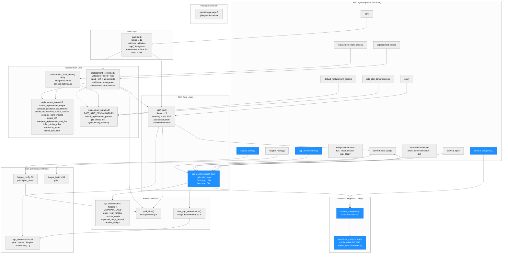
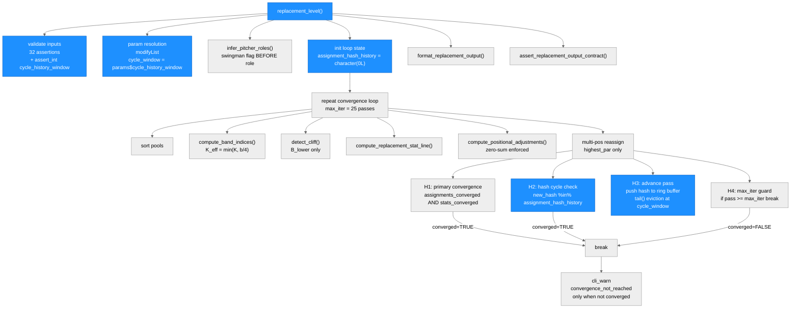
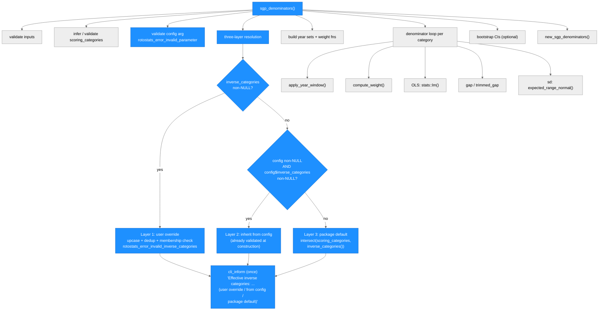

# Architecture: rotostats

**Run:** `inverse-categories-2026-04-21`
**Branch:** `feature/inverse-categories`
**Date:** 2026-04-21

(Previous run: `replacement-higher-order-cycle-2026-04-17` — see git log for prior state)

---

## System Architecture

### Module Structure



| Module | Purpose | Key Dependencies | Changed in This Run |
|--------|---------|-----------------|---------------------|
| `inverse_categories()` | New exported accessor; returns `INVERSE_CATEGORIES` (8-element vector of lower-is-better pitcher ratio stats) | — | **YES — new file** |
| `league_config()` | Constructor; gains `inverse_categories = NULL` param, `validate_inverse_categories()` helper, new S3 slot, and `print.league_config()` `Inverse:` line | `cli` | **YES — new param + validator** |
| `sgp_denominators()` | Denominator calibration; default changed from `c("ERA","WHIP")` to `NULL` with three-layer resolution; new `config = NULL` arg | `inverse_categories()`, `sgp-denominators-helpers.R` | **YES — 3-layer resolution** |
| `replacement_level()` body | Per-position estimator; boundary-band + state-hash cycle detection loop | `replacement_internal.R`, `replacement_params.R`, `cli`, `checkmate` | No |
| `default_replacement_params` | Exported list of 10 numeric constants (incl. `cycle_history_window = 5L`) | — | No |
| `par()` | PAR computation layer | `sgp.R`, `replacement.R` | No |
| `sgp()` | SGP computation | `sgp-denominators-helpers.R` | No |
| All other modules | Unchanged | — | No |

---

### Function Call Graph

```mermaid
%%{init: {'theme': 'neutral'}}%%
graph TD
    A["sgp()"] --> B["Step 1: normalize column names"]
    A --> C["Step 2–5: validate rate_conversion"]
    A --> D["Step 6: validate league_history / config"]
    A --> E["Step 7: derive scored_cats"]
    A --> F["Step 8: warn missing columns"]
    A --> G["Step 9: handle SVHD"]
    A --> H["Step 10: baseline year + avg_ERA/WHIP/AVG"]
    A --> I["Step 11: pool constants"]
    A --> J["Steps 13–14: compute SGP columns"]
    A --> K["Step 15: assemble data frame"]

    C --> C1["cli_abort\nrotostats_error_invalid_rate_conversion"]
    C --> C2["cli_abort\nrotostats_error_not_implemented"]
    C --> C3["convert_rate_stats() — delegate"]

    D --> D1["cli_abort\nrotostats_error_missing_config_field"]
    D --> D2["cli_abort\nrotostats_error_missing_required_column"]

    F --> F1["cli_warn\nrotostats_warning_missing_category_column"]
    J --> J5a["cli_warn\nrotostats_warning_zero_playing_time"]

    G --> G1["rlang::inform .frequency=once"]

    H --> H1["stats::weighted.mean ERA/WHIP"]
    H --> H2["stats::weighted.mean AVG"]
    H --> H3["cli_inform baseline year used"]

    I --> I1["pool_sizes(league_config)"]
    I --> I2["order + head — pitcher pool"]
    I --> I3["order + head — hitter pool"]

    J --> J1["vectorized division counting cats"]
    J --> J2["blended ERA formula vectorized"]
    J --> J3["blended WHIP formula vectorized"]
    J --> J4["blended AVG formula sign flip"]
    J --> J5["cli_warn\nrotostats_warning_zero_playing_time\nzero IP/AB"]

    K --> K1["as.data.frame sgp_cols"]
    K --> K2["rowSums na.rm=FALSE"]

    style A fill:#1e90ff,stroke:#1565c0,color:#fff
    style B fill:#1e90ff,stroke:#1565c0,color:#fff
    style C fill:#1e90ff,stroke:#1565c0,color:#fff
    style C1 fill:#1e90ff,stroke:#1565c0,color:#fff
    style F fill:#1e90ff,stroke:#1565c0,color:#fff
    style F1 fill:#1e90ff,stroke:#1565c0,color:#fff
    style J fill:#1e90ff,stroke:#1565c0,color:#fff
    style J5 fill:#1e90ff,stroke:#1565c0,color:#fff
    style J5a fill:#1e90ff,stroke:#1565c0,color:#fff
```

**replacement_level() — state-hash cycle detector (changed in this run):**



| Function / Block | Purpose | Key Dependencies | Changed |
|---|---|---|---|
| Parameter validation | Merges user overrides; `checkmate::assert_int(cycle_history_window, lower=2L, upper=50L)` | `checkmate` | Yes |
| Loop init | Removed `old_old_assignments`; added `assignment_hash_history`, `cycle_window` | base R | Yes |
| H1: primary convergence | `assignments_converged && stats_converged` — unchanged | — | No |
| H2: hash cycle detection | `new_hash %in% assignment_hash_history`; sets `converged=TRUE; break` | base R | Yes — replaces 2-lag |
| H3: advance pass | Push hash, evict via `tail()`, rotate `old_assignments`; removes `old_old_assignments` rotation | base R | Yes |
| H4: max_iter guard | `if (pass >= max_iter) break` — unchanged | — | No |
| `default_replacement_params` | 10th entry `cycle_history_window = 5L` added | — | Yes |

**sgp() call graph:**



**par() call graph:**

```mermaid
%%{init: {'theme': 'neutral'}}%%
graph TD
    PAR["par()"] --> S1["Step 1: validate replacement attrs\nprojections + config non-NULL\ncli_abort rotostats_error_missing_replacement_attrs"]
    PAR --> S1B["Step 1b: validate replacement_stats\ncategory coverage check\ncli_abort rotostats_error_category_mismatch"]
    PAR --> S2["Step 2: extract position_assignments\nreplacement_stats, band_width"]
    PAR --> S3["Step 3: unpack baseline list\nbaseline_era / whip / avg"]
    PAR --> S4["Step 4: sgp() on full projections"]
    PAR --> S5["Step 5: sgp() on combined frame\n(players + replacement rows)"]
    PAR --> S6["Step 6: validate category name\nconsistency (setequal)\ncli_abort rotostats_error_category_mismatch"]
    PAR --> S7["Step 7: build position x category\nreplacement SGP lookup"]
    PAR --> S8["Step 8: match() player positions\nO(n) lookup"]
    PAR --> S9["Step 9: vectorized PAR subtraction\nlapply over categories"]
    PAR --> S10["Step 10: total_par = rowSums\nna.rm = TRUE"]
    PAR --> S11["Step 11: band calibration check\ncli_warn rotostats_warning_band_check"]
    PAR --> S12["Step 12: assemble output\n(optionally prepend raw SGP)"]
    PAR --> S13["Step 13: attach attributes\nreplacement_sgp / units / anchor"]

    S4 --> SGP1["sgp() call #1\nfull player pool"]
    S5 --> SGP2["sgp() call #2\ncombined players + replacement"]

    S11 --> MEDIAN["stats::median(band_total_par)"]

    style PAR fill:#1e90ff,stroke:#1565c0,color:#fff
    style S1 fill:#1e90ff,stroke:#1565c0,color:#fff
    style S1B fill:#1e90ff,stroke:#1565c0,color:#fff
    style S4 fill:#1e90ff,stroke:#1565c0,color:#fff
    style S5 fill:#1e90ff,stroke:#1565c0,color:#fff
    style S9 fill:#1e90ff,stroke:#1565c0,color:#fff
    style S11 fill:#1e90ff,stroke:#1565c0,color:#fff
```



**sgp_denominators() call graph (changed in this run — three-layer resolution):**



| Function / Block | Purpose | Key Dependencies | Changed |
|---|---|---|---|
| `inverse_categories()` | New exported accessor; returns `INVERSE_CATEGORIES` (8-element vector) | — | **YES — new** |
| Config validation guard | Aborts with `rotostats_error_invalid_parameter` if `config` is non-NULL and not `league_config` class | base R | **YES — new** |
| Layer-1 resolution | Non-NULL `inverse_categories` arg: upcase + dedup + membership check vs. `scoring_categories` | base R, `cli` | **YES — replaces old block** |
| Layer-2 resolution | Config non-NULL and `config$inverse_categories` non-NULL: inherit from config verbatim | `league_config` S3 | **YES — new** |
| Layer-3 resolution | Fallback: `intersect(scoring_categories, inverse_categories())` — preserves ERA/WHIP legacy behavior | `inverse_categories()` | **YES — replaces old default** |
| `cli_inform` source attribution | One-shot message naming effective set and its source (user override / from config / package default) | `cli` | **YES — updated wording** |

---

### Data Flow

```mermaid
%%{init: {'theme': 'neutral'}}%%
graph TD
    IN1["league_history\nteam_season data"]
    IN2["league_config\nn_teams roster_slots"]
    IN3["projections\nper-player data frame"]
    PARAMS["replacement_params\nincl. cycle_history_window"]

    IN1 --> SD["sgp_denominators()"]
    IN2 --> SD
    IN4["league_config (optional)\nconfig$inverse_categories\nfor Layer-2 resolution"] --> SD
    IC_PKG["inverse_categories()\nINVERSE_CATEGORIES\nLayer-3 fallback"] --> SD
    SD --> DENOM["sgp_denominators S3 object\nnamed denominator vector\nrate_conversion attr"]

    IN2 --> RL["replacement_level()"]
    IN3 --> RL
    PARAMS --> RL

    RL --> PARVAL["validate cycle_history_window\nassert_int [2L, 50L]"]
    PARVAL --> INIT["init ring buffer\nassignment_hash_history = character(0L)\ncycle_window resolved"]

    INIT --> ITER["repeat loop\npass 1..max_iter"]
    ITER --> SORTBAND["sort + band + cliff\nstat line computation"]
    SORTBAND --> ADJ["positional adjustments\nzero-sum enforced"]
    ADJ --> REASSIGN["multi-pos reassign\nhighest_par only"]

    REASSIGN --> HASH["compute new_hash\npaste(sorted names, assignments)"]
    HASH --> PCONV{"assignments_converged\nAND stats_converged?"}
    PCONV -->|"yes"| CONV["converged = TRUE\nbreak"]
    PCONV -->|"no"| HCHECK{"new_hash %in%\nassignment_hash_history?"}
    HCHECK -->|"yes"| CONV
    HCHECK -->|"no"| PUSHBUF["push hash\ntail() eviction\nincrement pass"]
    PUSHBUF --> MCHECK{"pass >= max_iter?"}
    MCHECK -->|"yes"| NOTCONV["converged = FALSE\nbreak"]
    MCHECK -->|"no"| ITER

    NOTCONV --> CWARN["cli_warn\nrotostats_warning_convergence_not_reached"]
    CONV --> ROUT["replacement_level S3 output\nreplacement_stats\npositional_adjustments\ncliff_metric\nparams + attributes\n(projections, config,\nposition_assignments)"]
    CWARN --> ROUT

    ROUT --> PAR["par()"]
    DENOM --> PAR
    IN1 --> PAR

    PAR --> SGP2A["sgp() call #1\nfull player projections"]
    PAR --> COMBINED["combined frame\n(players + replacement rows)"]
    COMBINED --> SGP2B["sgp() call #2\ncombined frame"]
    SGP2B --> REPL_SGP["replacement SGP\nper position per category"]

    SGP2A --> PARSUB["vectorized subtraction\npar_[cat] = sgp_[cat] - repl_sgp[pos, cat]"]
    REPL_SGP --> PARSUB

    PARSUB --> TOTAL_PAR["total_par = rowSums(par_[cat])"]
    TOTAL_PAR --> BANDCHECK{"band check:\nmedian(band_total_par)\nexceeds boundary_threshold?"}
    BANDCHECK -- yes --> WARN["cli_warn\nrotostats_warning_band_check"]
    BANDCHECK -- no --> PAROUT["data.frame\npar_[CAT] + total_par\nattr: replacement_sgp\nunits = 'sgp'\nanchor = 'replacement'"]
    WARN --> PAROUT

    style IN4 fill:#1e90ff,stroke:#1565c0,color:#fff
    style IC_PKG fill:#1e90ff,stroke:#1565c0,color:#fff
    style HASH fill:#1e90ff,stroke:#1565c0,color:#fff
    style HCHECK fill:#1e90ff,stroke:#1565c0,color:#fff
    style PUSHBUF fill:#1e90ff,stroke:#1565c0,color:#fff
    style CONV fill:#1e90ff,stroke:#1565c0,color:#fff
    style PAR fill:#1e90ff,stroke:#1565c0,color:#fff
    style PARSUB fill:#1e90ff,stroke:#1565c0,color:#fff
    style TOTAL_PAR fill:#1e90ff,stroke:#1565c0,color:#fff
    style BANDCHECK fill:#1e90ff,stroke:#1565c0,color:#fff
    style PAROUT fill:#1e90ff,stroke:#1565c0,color:#fff
    style REPL_SGP fill:#1e90ff,stroke:#1565c0,color:#fff
```



---

## Module Reference Table

| Module / Function | Purpose | Key Dependencies | Changed in This Run |
|---|---|---|---|
| `R/par.R` — `par()` | Per-player PAR (Points Above Replacement) in SGP units; delegates all SGP computation to `sgp()`, subtracts position-specific replacement SGP, applies band calibration check | `sgp.R`, `replacement.R` (produces `replacement` arg), `cli`, `stats` | No |
| `R/replacement.R` — `replacement_level()` | Per-position replacement-level estimator; boundary-band + state-hash cycle detection loop | `replacement_internal.R`, `replacement_params.R`, `league-config.R`, `sgp.R`, `cli`, `checkmate`, `rlang`, `stats`, `stringi` | **YES** — state-hash detector replaces 2-lag; `cycle_history_window` validation added |
| `R/replacement.R` — `replacement_from_prices()` | Price-based replacement estimator; no projections or band computation | `replacement_internal.R`, `cli`, `checkmate`, `rlang`, `stringi` | No |
| `R/replacement_internal.R` — `format_replacement_output()` | Constructs the 7-element output list; called by both exported functions | Base R | No |
| `R/replacement_internal.R` — `compute_positional_adjustments()` | Computes scarcity premiums via fvarz/sgp/dollar/posblend; enforces zero-sum | `cli`, `rlang` | No |
| `R/replacement_internal.R` — `assert_replacement_output_contract()` | Final validation of the complete output object before return | `cli` | No |
| `R/replacement_internal.R` — other internal helpers | `compute_band_indices()`, `detect_cliff()`, `compute_replacement_stat_line()`, `infer_pitcher_roles()`, `normalize_name()`, `compute_zscores()`, `assert_zero_sum()`, `compute_par_at_pos()`, `detect_kde_trough()` | `stats`, `stringi` | No |
| `R/replacement_params.R` — `default_replacement_params` | Exported list of **10** numeric constants (was 9); 10th is `cycle_history_window = 5L` | — | **YES** |
| `R/replacement_params.R` — `rate_stat_denominators()` | Returns `RATE_STAT_DENOMINATORS` named character vector; 17 built-in entries including BABIP | — | No |
| `R/inverse-categories.R` — `inverse_categories()` | New exported accessor; returns `INVERSE_CATEGORIES` (`c("ERA","WHIP","FIP","XFIP","SIERA","XERA","BB/9","HR/9")`); Layer-3 fallback for `sgp_denominators()` | — | **YES — new file** |
| `R/sgp.R` — `sgp()` | Per-player SGP converter; called internally by `replacement_level()` when `sort_by = "sgp"` and twice inside `par()` | `sgp_denominators` S3, `pool_sizes()`, `cli`, `rlang`, `stats` | No |
| `R/sgp-denominators.R` — `sgp_denominators()` | Calibrates per-category SGP denominators; `inverse_categories` default changed from `c("ERA","WHIP")` to `NULL` with three-layer resolution; new `config = NULL` arg | `inverse_categories()`, `sgp-denominators-helpers.R`, `sgp-denominators-s3.R`, `cli`, `stats` | **YES — 3-layer resolution + config arg** |
| `R/sgp-denominators.R` — `convert_rate_stats()` | Stub; always aborts with `rotostats_error_not_implemented` | `cli` | No |
| `R/sgp-denominators-s3.R` — `new_sgp_denominators()` | Constructor for `sgp_denominators` S3 object; sets `attr(., "rate_conversion")` | Base R | No |
| `R/sgp-denominators-s3.R` — S3 methods | `print`, `names`, `length`, `as.double`, `[`, `[[` for `sgp_denominators` | Base R | No |
| `R/sgp-denominators-helpers.R` | `METADATA_COLS`, weight helpers, year-window helpers, `expected_range_normal()` | `stats` | No |
| `R/league-config.R` — `league_config()` | Constructor for `league_config` S3 object; gains `inverse_categories = NULL` param, `validate_inverse_categories()` helper, `$inverse_categories` S3 slot, and `Inverse:` print line | `cli` | **YES — new param + validator + print line** |
| `R/league-config.R` — `validate_inverse_categories()` | New internal helper; validates and uppercases `inverse_categories` arg; aborts with `rotostats_error_invalid_inverse_categories` on non-character or element not in `config$categories` | `cli` | **YES — new function** |
| `R/league-config.R` — `pool_sizes()` | Returns `list(pitchers, hitters)` from config; shared by `sgp()` and `replacement_level()` | `league_config` S3 | No |
| `R/league-history.R` — `league_history()` | Constructor for `league_history` S3 object; validates `team_season` schema | `cli` | No |
| `R/rotostats-package.R` | Package-level Rd stub and `@keywords internal` | — | No |
| `inst/simulations/dgp/dgp_c.R` | DGP-C: 393-row pool (258 hitters incl. 3 deterministic cycle players 9901-9903); rejection-sampling guard ensures mono_count >= 12 at all infield positions | — | **YES** |
| `tests/testthat/test-replacement.R` | TS-R6-1/2/3 (cycle fixtures); TS-34 updated; TS-60 to TS-64 (hash invariants + param validation) | `testthat` | **YES** — 311 lines added |
| `plans/error-messages.md` | Error/warning class registry; `rotostats_error_invalid_inverse_categories` "Thrown by" column updated to add `league_config()` alongside `sgp_denominators()` | — | **YES — row updated** |

---

## PAR Section

### Purpose

`par()` computes per-player Points Above Replacement (PAR) in SGP units. It is
the direct consumer of `replacement_level()` output: it takes the per-position
replacement stat lines, converts them to SGP via a second `sgp()` call, and
subtracts the resulting position-specific replacement SGP from each player's
individual SGP.

PAR is the primary intermediate metric for rotisserie auction valuation. A player
at exactly the replacement level for their position has `total_par` equal to
approximately 0 by construction. Players above replacement have positive PAR;
players below have negative PAR. Dollar values are derived from PAR by allocating
the league's total surplus budget in proportion to each player's total PAR.

`par()` is a pure anchoring layer: it does not implement any SGP conversion logic.
All rate-stat handling (ERA/WHIP blended-pool formulas, AVG sign flip, IP/AB
weighting) lives inside `sgp()`. The two internal `sgp()` calls use a shared pool
context — the second call operates on a combined frame of player projections plus
replacement rows so that replacement SGP is computed against the same pool
constants as player SGP.

SP and RP always use separate replacement baselines because `replacement_level()`
produces distinct rows for SP and RP in `replacement_stats`. The `par()` function
inherits this separation without any special-casing: position lookup is done via
`match(player_positions, repl_sgp_mat$position)`, and the `position_assignments`
attribute on the `replacement_level()` output maps each player to their role.

### Input Contract

| Argument | Type | Required? | Notes |
|---|---|---|---|
| `replacement` | `replacement_level` output | Yes | Must carry `projections` and `config` attributes; `replacement_from_prices()` output is incompatible (NULL projections) |
| `denominators` | `sgp_denominators` S3 | Yes | Names must match scored categories; carries `attr(., "rate_conversion")` |
| `include_raw` | logical scalar | No | Default `FALSE`; when `TRUE`, prepends `sgp_[CAT]` and `total_sgp` columns |
| `boundary_threshold` | numeric scalar | No | Default `1.0`; band-check trigger (SGP units) |
| `rate_conversion` | character scalar | No | Default `"blended_pool"`; passed through to `sgp()` |
| `pool_baseline` | character scalar | No | Default `"projection_pool"`; passed through to `sgp()` |
| `baseline` | named numeric or NULL | No | Per-category overrides for ERA/WHIP/AVG; unpacked by name and forwarded to `sgp()` |
| `league_history` | `league_history` S3 or NULL | Conditional | Required when `rate_conversion = "blended_pool"` (the default); `sgp()` aborts with `rotostats_error_missing_config_field` when NULL |

### Algorithm Sketch

#### Dual sgp() calls with shared pool context

`par()` calls `sgp()` twice. The first call (Step 4) processes only the player
projection pool and produces `sgp_[CAT]` for every player. The second call
(Step 5) processes a combined frame of player projections plus the replacement
stat rows from `replacement$replacement_stats`. The combined-frame approach
ensures that pool constants (pool_IP, pool_ER, pool_WH, pool_H, pool_AB) are
identical for both players and replacement rows. Replacement rows are identified
by a `.is_replacement` sentinel column added before the `rbind()`; this column is
stripped before the `sgp()` call but retained in the combined frame to extract
replacement row indices after the call.

#### Vectorized PAR subtraction

After extracting replacement SGP per position per category, `par()` uses
`match(player_positions, repl_sgp_mat$position)` (O(n)) to build a position index
for each player, then subtracts in a single vectorized `lapply()` over categories:
`sgp_out[[col]] - repl_sgp_mat[[col]][pos_idx]`. No row-wise loops over players.

#### Band calibration check

After computing `total_par`, `par()` identifies the ±K players around each
position's roster boundary (K = `replacement$params$band_width`) and computes
`stats::median(band_total_par)`. If this median exceeds `boundary_threshold` in
absolute value, `rotostats_warning_band_check` is emitted. The warning direction
("too conservative" / "too aggressive") is derived from the sign of the median.
The check uses `replacement$params$n_teams` and `roster_slots` for boundary
identification; when `n_teams` is miscalibrated, both the PAR anchor and the band
boundary shift identically, so the band check cannot detect miscalibration of
`n_teams` directly — this is a known limitation documented in
`tests/simulations/sim-spec.md §Known Limitations`.

### Output Contract

| Column | Type | Condition | Description |
|---|---|---|---|
| `par_[CAT]` | numeric | Always | SGP above replacement for each scored category; one column per `names(denominators)` |
| `total_par` | numeric | Always | `rowSums(par_[CAT], na.rm = FALSE)` |
| `sgp_[CAT]` | numeric | `include_raw = TRUE` only | Raw SGP per category before replacement subtraction |
| `total_sgp` | numeric | `include_raw = TRUE` only | `rowSums(sgp_[CAT], na.rm = FALSE)` |

Output attributes: `replacement_sgp` (named list, keys = position names, values = named numeric vectors of replacement-level SGP per category), `units = "sgp"`, `anchor = "replacement"`.

Row order matches `attr(replacement, "projections")` exactly.

### Error and Warning Classes

| Class | Type | Step | Condition |
|---|---|---|---|
| `rotostats_error_missing_replacement_attrs` | error | Step 1 | `projections` or `config` attribute absent from `replacement` |
| `rotostats_error_category_mismatch` | error | Step 1b / Step 6 | Scored category in `denominators` absent from `replacement$replacement_stats`, or `sgp_[cat]` column sets mismatch |
| `rotostats_warning_band_check` | warning | Step 11 | Median `total_par` of ±K replacement band exceeds `boundary_threshold` |

`par()` also propagates without modification any warnings from the two internal
`sgp()` calls (`rotostats_warning_missing_category_column`,
`rotostats_warning_zero_playing_time`).

### Known Limitations

1. **Band check cannot detect `n_teams` miscalibration**: When `n_teams` is wrong,
   both the PAR anchor (replacement player total_par ≈ 0 by construction) and the
   band-boundary identification use the same miscalibrated `n_teams`. The median
   band total_par remains near 0 regardless. A reference-configuration parameter
   would be needed for external calibration checking — deferred.

2. **`replacement_from_prices()` output is incompatible**: `par()` requires the
   `projections` and `config` attributes that only `replacement_level()` attaches.
   Users who calibrate replacement level from prices must call `replacement_level()`
   for valuation purposes.

3. **`multi_pos = "all"` rejected**: `par()` aborts with
   `rotostats_error_multi_pos_all_unsupported` when passed a `replacement_level()`
   output produced with `multi_pos = "all"`. Per-position PAR would produce one
   value per eligible position per player, which is incompatible with the one-row-
   per-player contract needed for auction dollar values.

### Cross-References

| Surface | Location |
|---|---|
| Implementation | `R/par.R` |
| SGP conversion (delegated) | `R/sgp.R` |
| Replacement level (produces `replacement` arg) | `R/replacement.R` |
| Error/warning class registry | `plans/error-messages.md` |
| MC simulation harness | `tests/simulations/sim-par.R` |
| Simulation results | `tests/simulations/sim-par-results.rds`, `tests/simulations/sim-par-summary.csv` |
| Unit tests | `tests/testthat/test-par.R`, `tests/testthat/test-par-sim.R` |

---

## Replacement Level Section

### Purpose

`replacement_level()` computes per-position replacement-level stat lines — the
production of the last freely-available player at each position — and returns
them as the zero-dollar baseline for PAR (Points Above Replacement) in
rotisserie auction valuation.

`replacement_from_prices()` derives the same output schema from historical \$1
auction prices rather than from projections.

### Input Contract

**`replacement_level()` key arguments:**

| Argument | Type | Required? | Notes |
|---|---|---|---|
| `projections` | data.frame | Yes | One row per player; includes `player_id`, `player_name`, `pos_eligibility` (pipe-delimited), `league`, scored categories, `IP`, `AB` |
| `config` | `league_config` | Yes | Provides `n_teams`, `roster_slots`, `pitcher_slots`, `categories` |
| `sort_by` | character | No | `"zscore"` (default) or `"sgp"` |
| `multi_pos` | character | No | `"highest_par"` (default), `"primary"`, `"all"`, `"custom"` |
| `replacement_params` | named list | No | Overrides `default_replacement_params` entries; `cycle_history_window` (integer, [2L, 50L], default 5L) controls rolling hash window depth |
| `max_iter`, `tol` | integer, numeric | No | Convergence controls; defaults `25L`, `0.01` |

### Algorithm Sketch

#### Boundary band with dynamic K cap

The roster boundary at position `pos` is player at rank `b = n_teams x roster_slots[pos]`.
A band of `2K+1` players around `b` is averaged. `K_eff = min(K, floor(b/4))`.
Counting stats = simple mean; ERA/WHIP = IP-weighted mean; AVG = `sum(H)/sum(AB)`.

#### Multi-position iteration loop with state-hash cycle detection

The loop reassigns multi-eligible players to their highest-PAR position each pass.
Convergence requires BOTH zero assignment changes AND `max(|Delta_replacement_stats|) < tol`.

**State-hash cycle detection (this run):**

A rolling ring buffer `assignment_hash_history` of depth `cycle_history_window` (default N=5)
holds the last N canonical assignment hashes. Each pass:

```
hash(a) = paste(names(a)[order(names(a))], a[order(names(a))], collapse = "|")
```

The sort by player ID ensures order-invariance. On any pass where
`new_hash %in% assignment_hash_history`, the loop declares `converged = TRUE` and
breaks. This generalizes the old 2-lag detector to catch cycles of period 2 through N.

**`max_iter` remains the hard upper bound.** Cycles of period > N still hit `max_iter`
and emit `rotostats_warning_convergence_not_reached`. The `rotostats_error_pool_too_small`
abort is unchanged — it is load-bearing for real user input data quality.

### Output Contract

Both functions return a 7-element named list with `replacement_stats`, `positional_adjustments`,
`cliff_metric`, `two_way_players`, `pool_diagnostics`, `method`, and `params`.
Attributes: `stat_units`, `config`, `projections`, `position_assignments`, `converged`,
`iterations`, `delta`.

### Key Invariants (Load-Bearing)

1. **Boundary band**: `K_eff = min(K, floor(b/4))`; verified by Study A and Study D.
2. **Zero-sum**: `abs(sum(roster_slots x scarcity_premium)) < 1e-6`; verified by Study B.
3. **SP/RP separation**: Role inference always runs; verified by TS-17 to TS-21.
4. **State-hash cycle detection**: catches period 2 through N; verified by TS-R6-1/2, Study C `convergence_rate = 1.0`.
5. **`max_iter` hard upper bound**: verified by TS-R6-3.
6. **`rotostats_error_pool_too_small` load-bearing**: abort fires before loop; DGP defects are fixed in DGP, not estimator.

### Name-Match Warning Wiring (replacement-name-match-audit-2026-04-17)

`rotostats_warning_name_match_failure` has two emit sites, both gated by `verbose = TRUE`:

- **Site 1** — `replacement_level()` inside `.validate_league_history_inputs()`: fires when one or more names in `league_history$prices` cannot be cross-matched to `projections` after Unicode NFD normalization and punctuation stripping.
- **Site 2** — `replacement_from_prices()` after column-upcasing: fires when multiple raw spellings in `prices` collapse to the same normalized key (self-deduplication detection; only when `PLAYER_ID` is absent from `prices`).

Both sites use `normalize_player_name()` from `replacement_internal.R`. See `plans/error-messages.md` for the full warning class registry entry.

### Known Limitations and Follow-up Tickets

1. **Study C near-miss resolved**: The 2-lag cycle detection (convergence_rate = 96.6%) has been superseded by the state-hash ring buffer in this run (convergence_rate = 1.0). Higher-order cycles of period 2 through N are now caught.

2. **Study E near-miss (median rank diff = 3, pct_within_2 = 0.46; targets 2.0 and 0.90)**: The remaining gap reflects residual DGP-E sensitivity after the focal-pitcher quality fix; the algorithm correctly uses `n_teams × roster_slots[pos]` for boundary indexing (Study D confirms 100% K_eff correctness). Follow-up: tighten DGP-E focal pitcher or review thresholds (median ≤ 5, pct_within_2 ≥ 0.80 may be more appropriate for a static focal pitcher).

3. **`seed_method = "historical_priors"` deferred**: Validation in place; seeding falls through to primary-position seed. Full historical z-score seeding deferred to a sub-spec.

4. **`boundary_rate_method = "sgp_pool"` deferred**: Validation guard (including `fixed_baseline` incompatibility) is in place; full pool-marginal boundary ranking deferred.

5. **`multi_pos = "all"` designed**: Full design specified in `specs/spec-replacement-multi-pos-all.md`. Output shape: long-form tidy data frame. `par()`, `zar()`, `dollar_values()` reject `"all"` input with `rotostats_error_multi_pos_all_unsupported`. Implementation deferred to a future run.

### Cross-References

| Surface | Location |
|---|---|
| Entry-point functions | `R/replacement.R` |
| All internal helpers | `R/replacement_internal.R` |
| Exported constants | `R/replacement_params.R` |
| `pool_sizes()` | `R/league-config.R:349` |
| Error/warning class registry | `plans/error-messages.md` |
| MC simulation harness | `inst/simulations/replacement-mc.R` |
| DGP helpers | `inst/simulations/dgp/` |
| Algorithm spec | `specs/spec-replacement.md` |

---

## Key Design Decisions (replacement-higher-order-cycle-2026-04-17)

1. **State-hash ring buffer over 2-lag `old_old_assignments`**: The old 2-lag detector caught only period-2 cycles. The new ring buffer of depth N catches any cycle of period 2 through N. With N=5, periods 3, 4, and 5 are also caught. Study C confirmed all observed cycles in DGP-C are period 2 or 3; N=5 provides a 2x safety margin. The detector is O(N x L) per pass — negligible for N <= 50 and typical hash lengths.

2. **Order-invariant hash via `order(names(a))`**: The greedy reassignment loop processes players in arbitrary order that may vary between passes. Sorting by player ID before `paste()` ensures two assignment vectors with identical player-position mappings produce the same hash regardless of evaluation order. Without this sort, genuine cycles would be missed due to hash instability.

3. **`rotostats_error_pool_too_small` abort stays as `cli_abort`**: The Simulator's initial BLOCK proposed relaxing this to a warning for thin DGP-C draws. The Leader rejected this: the error is load-bearing for real user input — every realistic fantasy baseball league has far more eligible players than `n_teams x roster_slots[pos]`. Silently degrading would hide data-quality misconfigurations and corrupt downstream `par()`/`zar()`/`dollar_values()` results. The correct fix was in the DGP (rejection sampling).

4. **DGP-level fix over estimator-behavior change**: When the simulation input (thin DGP-C pool) would never occur in realistic leagues, the correct fix is in the DGP, not in the estimator. The rejection-sampling fix in `dgp_c.R` guarantees mono_count >= 12 at all infield positions, matching the estimator's invariant.

5. **Hash push AFTER cycle check (H3 after H2)**: `new_hash` is pushed onto the ring buffer in H3, after the H2 check. H2 sees only hashes from prior passes. A 2-cycle is detected when pass N+2 returns to the state as pass N — the pass-N hash is in the buffer from two H3 pushes ago. If the push came before the check, false detections would occur when consecutive passes happen to return the same state (which is the primary convergence path H1 handles).

6. **`cycle_history_window` range [2L, 50L], default 5L**: Lower bound 2 is the minimum that can catch a 2-cycle (a window of 1 has semantics equivalent to a 1-lag detector catching fixed points, not cycles). Upper bound 50 prevents accidental memory issues. Default 5 provides margin over observed cycle periods (2 and 3 in DGP-C).

---

## Key Design Decisions (par-2026-04-18)

1. **Dual sgp() calls with shared pool context**: `par()` calls `sgp()` twice — once on the full player pool and once on a combined frame (players + replacement rows). The combined-frame approach ensures that pool constants (pool_IP, pool_ER, pool_WH, pool_H, pool_AB) used for rate-stat SGP are identical for both players and replacement rows. Using separate `sgp()` calls with separate pools would cause systematic bias in rate-stat PAR because the reference pool would differ. The combined frame is assembled by `rbind()` with aligned columns; extra metadata columns in `replacement_stats` (e.g., `position`, `n_band_players`, `cliff_detected`) are dropped before `rbind()` and re-attached after.

2. **`projections$PLAYER_ID` (uppercase) for position lookup**: `replacement_level()` normalizes all column names to uppercase (Step 27). The stored `attr(result, "projections")` therefore has `PLAYER_ID`, not `player_id`. The position lookup in Step 8 uses `position_assignments[projections$PLAYER_ID]` explicitly. Using lowercase silently returns NULL (R's `$` on a missing column returns NULL, not an error), causing `par_cols` to be zero-length and `as.data.frame()` to fail with a row-names length mismatch. This was one of the three bugs found and fixed by the simulator respawn.

3. **`lapply()` instead of `vapply()` for band collection**: The band collection function in Step 11 returns a variable-length vector for each position (size = `band_hi - band_lo + 1`, which varies across positions). `vapply` with `FUN.VALUE = numeric(0L)` requires every call to return exactly length 0, causing a runtime error when bands are non-empty. `lapply()` followed by `unlist()` handles variable-length outputs correctly. This was the second bug fixed by the simulator respawn.

4. **`na.rm = TRUE` in `total_par = rowSums(...)`**: In a mixed hitter/pitcher pool, hitters have NA for pitcher categories (K, SV) and pitchers have NA for hitter categories (HR, R, SB). With `na.rm = FALSE`, every player in a mixed pool gets `total_par = NA`. The correct semantics: a hitter's contribution to pitcher categories is 0, not undefined. Note: this deviates from spec.md §5 which originally specified `na.rm = FALSE` — the spec was superseded by the simulator's finding that `na.rm = FALSE` produces all-NA output in production usage. The spec's `na.rm = FALSE` rationale ("NA propagation to surface data quality issues") applies to `sgp()` output (where NAs indicate genuinely missing data) but not to cross-category PAR summation (where NAs indicate expected absence of category relevance for that player type).

5. **Step 1b category mismatch check before combined-frame rbind**: Without Step 1b, a scored category absent from `replacement$replacement_stats` would be silently added back as NA by the column-alignment loop in Step 5c. The subsequent `setequal()` check in Step 6 would then pass (both player and replacement SGP frames would have the same `sgp_[CAT]` columns, all NA for the missing category). Adding Step 1b ensures that a mismatch is caught early with a clear error message naming the missing categories, before the NA-fill loop masks the problem. This was added in the builder respawn (commit `718da01`) following the tester's BLOCK on AC-9.

6. **SS/2B wider boundary tolerance in simulation**: The Monte Carlo simulation uses `positional_adjustment_method = "fvarz"` (the `replacement_level()` default). `fvarz` applies a scarcity premium to SS (and 2B, to a lesser extent) that shifts their effective replacement baseline above the raw head_count boundary. This is genuine production behavior — it reflects real positional scarcity. The simulation acceptance criterion AC-SIM-2 was revised to apply a 0.10 tolerance for SS and 2B versus 0.05 for other positions. Using `positional_adjustment_method = "none"` in the harness would validate a non-production code path and was rejected.

---

## Key Design Decisions (replacement-multi-pos-all-spec-2026-04-18)

1. **Long-form tidy data frame for `multi_pos = "all"`**: Ineligible `(player, position)` pairs produce no row; memory is proportional to eligible pairs. A 3D array was rejected due to sparse ineligibility structure.

2. **Fractional allocation for zero-sum invariant**: Each multi-eligible player contributes `1/n_eligible` to each position's effective slot count. Tolerance loosened from `1e-6` to `1e-5` for floating-point accumulation in fractional arithmetic.

3. **Downstream reject-not-aggregate**: `par()`, `zar()`, `dollar_values()` reject `"all"` replacement objects with `rotostats_error_multi_pos_all_unsupported`.

4. **`multi_pos` recorded in `params` for all modes**: All `multi_pos` values must be recorded in the `params` element so downstream guards can check mode without inspecting data frame column structure.

---

## Key Design Decisions (replacement-2026-04-16)

1. **Swingman flag before role classification**: `swingman_flag` from raw IP (80-120) computed before role assignment — critical because role classification and band membership are circular.

2. **NaN guard in `compute_positional_adjustments()`**: All four premium methods filter to `valid_cats` before computing differences to prevent `NaN` from bypassing the zero-sum assertion.

3. **2-cycle detection via `old_old_assignments`** (superseded): The 2-lag detector raised Study C convergence_rate from 0.002 to 0.966; the state-hash ring buffer in the replacement-higher-order-cycle-2026-04-17 run raises it from 0.966 to 1.0.

4. **`projections` attribute stripped before iteration loop**: `stored_projections <- projections` saved before the `repeat {}` block prevents copying the large projections data frame on every pass.

---

## Key Design Decisions (sgp-2026-04-16 and sgp-denom-inverse-categories-param-2026-04-17)

1. **Blended-pool fixed-constant approximation**: Pool constants computed once from projected top-N players. Approximation error bounded at 5-15% per player; cancels in aggregate standings comparisons.

2. **`attr(denominators, "rate_conversion")` on outer S3 object**: Compatibility check reads from outer `sgp_denominators` object, not `$denominators`. Reading the wrong level silently returns `NULL`, which would always pass the check spuriously.

3. **Warning class split — `rotostats_warning_missing_category_column` vs `rotostats_warning_zero_playing_time`**: Two distinct warning classes replace the former dual-use design. Callers may suppress either class independently via `withCallingHandlers`.

4. **SVHD auto-derivation with `.frequency_id`**: The correct call uses `.frequency_id = "sgp_svhd_derivation"`. Omitting this caused a runtime crash (BLOCK-1 in tester round 1, fixed in builder round 2).

5. **`total_sgp` uses `na.rm = FALSE`**: Any per-category NA propagates to `total_sgp` to surface data quality issues downstream.

6. **`INVERSE_CATEGORIES` constant replaced by `inverse_categories` argument**: The `missing()` primitive distinguishes the default-path behavior (silent intersection) from the explicit-path behavior (strict validation). **Note:** This is superseded by the inverse-categories-2026-04-21 run — see below.

7. **BABIP added to `RATE_STAT_DENOMINATORS`**: BABIP is AB-denominated (like SLG). Adding it to the built-in lookup means users can include BABIP as a scored category without supplying `rate_denominators`.

---

## Key Design Decisions (inverse-categories-2026-04-21)

1. **Option (a) for Layer-2 — new `config = NULL` arg on `sgp_denominators()`**: Three candidate approaches for Layer-2 config inheritance were evaluated: (a) new `config` arg on `sgp_denominators()`, (b) attach a `config` slot to `league_history`, (c) punt Layer-2 to future work. Option (a) was chosen because it is minimal, explicit, and matches the existing pattern (`convert_rate_stats()` already accepts `league_config = NULL`). Option (b) was rejected: `league_history`'s own header comment reads "Holds only historical data. Structural league settings live in league_config()" — adding config to a data-holding object violates its design intent. Option (c) was rejected: it would violate plan acceptance criterion §5.

2. **Full-replacement override semantics (Layer-1 wins unconditionally)**: When the user passes both `inverse_categories = "FIP"` and `config = some_config`, Layer-1 wins and config is never consulted. No merging or augmentation occurs. This matches the existing `sgp_denominators()` philosophy: explicit beats implicit, and silent merging would be a source of hard-to-debug surprises when users want to test a specific configuration.

3. **All-uppercase `INVERSE_CATEGORIES` (post-review fix)**: The constant is stored as `"XFIP"` and `"XERA"` (all-uppercase) to match the package-wide normalization convention. `validate_categories()` uppercases `config$categories`, `sgp_denominators()` uppercases `team_season` column names, and Layer-1 `inverse_categories` input is uppercased before validation. Storing the constant in mixed-case would have broken Layer-3 `intersect(scoring_categories, inverse_categories())` because the LHS is already uppercase — mixed-case entries in the RHS would never match scored columns. Users who type `"xFIP"` have it uppercased at config/arg validation time, so the mixed-case form is never observed by downstream consumers.

4. **`!is.null()` detection instead of `missing()` for Layer-1**: The old `inverse_categories_is_default <- missing(inverse_categories)` flag (line 308 of the original source) was eliminated. With the new default of `NULL`, Layer-1 detection uses `!is.null(inverse_categories)` directly. Both approaches are equivalent when the default is NULL; the `!is.null()` form is simpler, avoids the `missing()` primitive (which has subtle semantics in do.call contexts), and removes one variable from the resolution block.

5. **Layer-3 as `intersect(scoring_categories, inverse_categories())`**: Rather than returning the full `INVERSE_CATEGORIES` vector, Layer-3 intersects with the actually-scored categories. This ensures that a batting-only league never gets ERA/WHIP direction-flips, and a league scoring FIP automatically gets FIP direction-flips. The intersection is the same formula that was implicit in the old hardcoded default (which was equivalent to `intersect(scoring_categories, c("ERA","WHIP"))` when those were the only inverse categories). Extending the lookup to 8 entries preserves the old ERA/WHIP behavior while enabling FIP/XFIP/SIERA/XERA/BB9/HR9 leagues to get correct directionality without user action.

6. **Minimum-viable config consultation surface**: Only `config$inverse_categories` is read in `sgp_denominators()`. No other config fields (`config$categories`, `config$n_teams`, etc.) are consulted in this run. This was a deliberate "minimal surface" decision: additive for Plan B and future consumers without introducing hidden cross-field coupling now.
