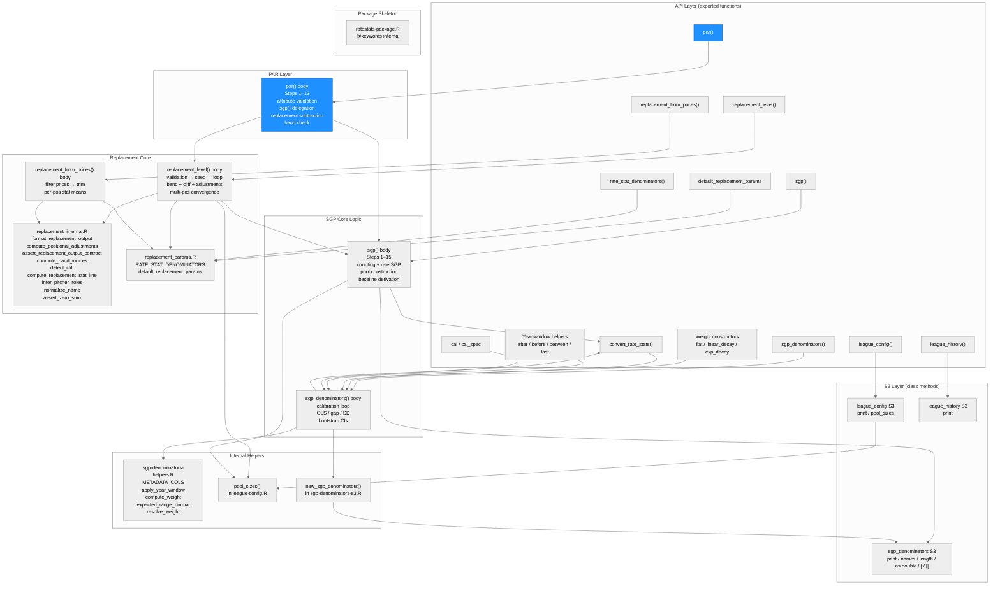
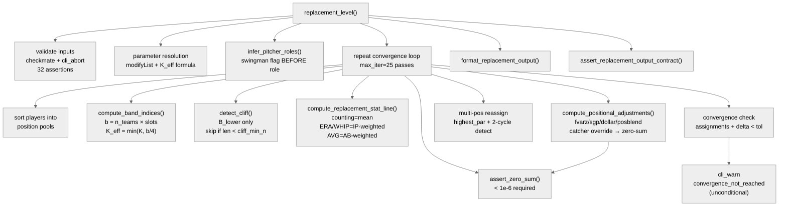
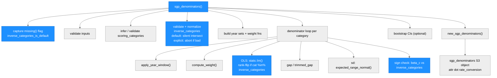
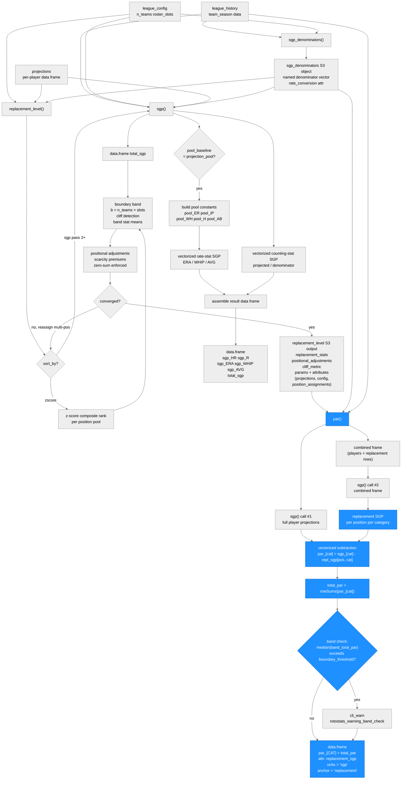

# Architecture: rotostats

**Run:** `par-2026-04-18`
**Branch:** `docs/par-architecture-news-log` @ (see git log)
**Date:** 2026-04-18

(Previous run: `replacement-multi-pos-all-spec-2026-04-18` — see git log for prior state)

---

## System Architecture

### Module Structure

### Function Call Graph

```mermaid
%%{init: {'theme': 'neutral'}}%%
graph TD
    A["sgp()"] --> B["Step 1: normalize column names"]
    A --> C["Step 2–5: validate rate_conversion"]
    A --> D["Step 6: validate league_history / config"]
    A --> E["Step 7: derive scored_cats"]
    A --> F["Step 8: warn missing columns"]
    A --> G["Step 9: handle SVHD"]
    A --> H["Step 10: baseline year + avg_ERA/WHIP/AVG"]
    A --> I["Step 11: pool constants"]
    A --> J["Steps 13–14: compute SGP columns"]
    A --> K["Step 15: assemble data frame"]

    C --> C1["cli_abort\nrotostats_error_invalid_rate_conversion"]
    C --> C2["cli_abort\nrotostats_error_not_implemented"]
    C --> C3["convert_rate_stats() — delegate"]

    D --> D1["cli_abort\nrotostats_error_missing_config_field"]
    D --> D2["cli_abort\nrotostats_error_missing_required_column"]

    F --> F1["cli_warn\nrotostats_warning_missing_category_column"]
    J --> J5a["cli_warn\nrotostats_warning_zero_playing_time"]

    G --> G1["rlang::inform .frequency=once"]

    H --> H1["stats::weighted.mean ERA/WHIP"]
    H --> H2["stats::weighted.mean AVG"]
    H --> H3["cli_inform baseline year used"]

    I --> I1["pool_sizes(league_config)"]
    I --> I2["order + head — pitcher pool"]
    I --> I3["order + head — hitter pool"]

    J --> J1["vectorized division counting cats"]
    J --> J2["blended ERA formula vectorized"]
    J --> J3["blended WHIP formula vectorized"]
    J --> J4["blended AVG formula sign flip"]
    J --> J5["cli_warn\nrotostats_warning_zero_playing_time\nzero IP/AB"]

    K --> K1["as.data.frame sgp_cols"]
    K --> K2["rowSums na.rm=FALSE"]

    style A fill:#1e90ff,stroke:#1565c0,color:#fff
    style B fill:#1e90ff,stroke:#1565c0,color:#fff
    style C fill:#1e90ff,stroke:#1565c0,color:#fff
    style C1 fill:#1e90ff,stroke:#1565c0,color:#fff
    style F fill:#1e90ff,stroke:#1565c0,color:#fff
    style F1 fill:#1e90ff,stroke:#1565c0,color:#fff
    style J fill:#1e90ff,stroke:#1565c0,color:#fff
    style J5 fill:#1e90ff,stroke:#1565c0,color:#fff
    style J5a fill:#1e90ff,stroke:#1565c0,color:#fff
```

**par() call graph:**

```mermaid
%%{init: {'theme': 'neutral'}}%%
graph TD
    PAR["par()"] --> S1["Step 1: validate replacement attrs\nprojections + config non-NULL\ncli_abort rotostats_error_missing_replacement_attrs"]
    PAR --> S1B["Step 1b: validate replacement_stats\ncategory coverage check\ncli_abort rotostats_error_category_mismatch"]
    PAR --> S2["Step 2: extract position_assignments\nreplacement_stats, band_width"]
    PAR --> S3["Step 3: unpack baseline list\nbaseline_era / whip / avg"]
    PAR --> S4["Step 4: sgp() on full projections"]
    PAR --> S5["Step 5: sgp() on combined frame\n(players + replacement rows)"]
    PAR --> S6["Step 6: validate category name\nconsistency (setequal)\ncli_abort rotostats_error_category_mismatch"]
    PAR --> S7["Step 7: build position x category\nreplacement SGP lookup"]
    PAR --> S8["Step 8: match() player positions\nO(n) lookup"]
    PAR --> S9["Step 9: vectorized PAR subtraction\nlapply over categories"]
    PAR --> S10["Step 10: total_par = rowSums\nna.rm = TRUE"]
    PAR --> S11["Step 11: band calibration check\ncli_warn rotostats_warning_band_check"]
    PAR --> S12["Step 12: assemble output\n(optionally prepend raw SGP)"]
    PAR --> S13["Step 13: attach attributes\nreplacement_sgp / units / anchor"]

    S4 --> SGP1["sgp() call #1\nfull player pool"]
    S5 --> SGP2["sgp() call #2\ncombined players + replacement"]

    S11 --> MEDIAN["stats::median(band_total_par)"]

    style PAR fill:#1e90ff,stroke:#1565c0,color:#fff
    style S1 fill:#1e90ff,stroke:#1565c0,color:#fff
    style S1B fill:#1e90ff,stroke:#1565c0,color:#fff
    style S4 fill:#1e90ff,stroke:#1565c0,color:#fff
    style S5 fill:#1e90ff,stroke:#1565c0,color:#fff
    style S9 fill:#1e90ff,stroke:#1565c0,color:#fff
    style S11 fill:#1e90ff,stroke:#1565c0,color:#fff
```

**replacement_level() call graph:**

**sgp_denominators() call graph (for reference):**

### Data Flow

---

## Module Reference Table

| Module / Function | Purpose | Key Dependencies | Changed in This Run |
|---|---|---|---|
| `R/par.R` — `par()` | Per-player PAR (Points Above Replacement) in SGP units; delegates all SGP computation to `sgp()`, subtracts position-specific replacement SGP, applies band calibration check | `sgp.R`, `replacement.R` (produces `replacement` arg), `cli`, `stats` | **YES (new)** |
| `R/replacement.R` — `replacement_level()` | Per-position replacement-level estimator; boundary-band + iteration loop | `replacement_internal.R`, `replacement_params.R`, `league-config.R` (`pool_sizes()`), `sgp.R` (when `sort_by="sgp"`), `cli`, `checkmate`, `rlang`, `stats`, `stringi` | No |
| `R/replacement.R` — `replacement_from_prices()` | Price-based replacement estimator; no projections or band computation | `replacement_internal.R`, `cli`, `checkmate`, `rlang`, `stringi` | No |
| `R/replacement_internal.R` — `format_replacement_output()` | Constructs the 7-element output list; called by both exported functions | Base R | No |
| `R/replacement_internal.R` — `compute_positional_adjustments()` | Computes scarcity premiums via fvarz/sgp/dollar/posblend; enforces zero-sum | `cli`, `rlang` | No |
| `R/replacement_internal.R` — `assert_replacement_output_contract()` | Final validation of the complete output object before return | `cli` | No |
| `R/replacement_internal.R` — other internal helpers | `compute_band_indices()`, `detect_cliff()`, `compute_replacement_stat_line()`, `infer_pitcher_roles()`, `normalize_name()`, `compute_zscores()`, `assert_zero_sum()`, `compute_par_at_pos()`, `detect_kde_trough()` | `stats`, `stringi` | No |
| `R/replacement_params.R` — `default_replacement_params` | Exported list of 9 numeric constants; user overrides via `replacement_params = list(...)` | — | No |
| `R/replacement_params.R` — `rate_stat_denominators()` | Returns `RATE_STAT_DENOMINATORS` named character vector; 17 built-in entries including BABIP | — | No |
| `R/sgp.R` — `sgp()` | Per-player SGP converter; called internally by `replacement_level()` when `sort_by = "sgp"` and twice inside `par()` | `sgp_denominators` S3, `pool_sizes()`, `cli`, `rlang`, `stats` | No |
| `R/sgp-denominators.R` — `sgp_denominators()` | Calibrates per-category SGP denominators from league history | `sgp-denominators-helpers.R`, `sgp-denominators-s3.R`, `cli`, `stats` | No |
| `R/sgp-denominators.R` — `convert_rate_stats()` | Stub; always aborts with `rotostats_error_not_implemented` | `cli` | No |
| `R/sgp-denominators-s3.R` — `new_sgp_denominators()` | Constructor for `sgp_denominators` S3 object; sets `attr(., "rate_conversion")` | Base R | No |
| `R/sgp-denominators-s3.R` — S3 methods | `print`, `names`, `length`, `as.double`, `[`, `[[` for `sgp_denominators` | Base R | No |
| `R/sgp-denominators-helpers.R` | `METADATA_COLS`, weight helpers, year-window helpers, `expected_range_normal()` | `stats` | No |
| `R/league-config.R` — `league_config()` | Constructor for `league_config` S3 object; validates roster / budget config | `cli` | No |
| `R/league-config.R` — `pool_sizes()` | Returns `list(pitchers, hitters)` from config; shared by `sgp()` and `replacement_level()` | `league_config` S3 | No |
| `R/league-history.R` — `league_history()` | Constructor for `league_history` S3 object; validates `team_season` schema | `cli` | No |
| `R/rotostats-package.R` | Package-level Rd stub and `@keywords internal` | — | No |
| `plans/error-messages.md` | Error/warning class registry; `rotostats_warning_band_check` added this run | — | **YES** |

---

## PAR Section

### Purpose

`par()` computes per-player Points Above Replacement (PAR) in SGP units. It is
the direct consumer of `replacement_level()` output: it takes the per-position
replacement stat lines, converts them to SGP via a second `sgp()` call, and
subtracts the resulting position-specific replacement SGP from each player's
individual SGP.

PAR is the primary intermediate metric for rotisserie auction valuation. A player
at exactly the replacement level for their position has `total_par` equal to
approximately 0 by construction. Players above replacement have positive PAR;
players below have negative PAR. Dollar values are derived from PAR by allocating
the league's total surplus budget in proportion to each player's total PAR.

`par()` is a pure anchoring layer: it does not implement any SGP conversion logic.
All rate-stat handling (ERA/WHIP blended-pool formulas, AVG sign flip, IP/AB
weighting) lives inside `sgp()`. The two internal `sgp()` calls use a shared pool
context — the second call operates on a combined frame of player projections plus
replacement rows so that replacement SGP is computed against the same pool
constants as player SGP.

SP and RP always use separate replacement baselines because `replacement_level()`
produces distinct rows for SP and RP in `replacement_stats`. The `par()` function
inherits this separation without any special-casing: position lookup is done via
`match(player_positions, repl_sgp_mat$position)`, and the `position_assignments`
attribute on the `replacement_level()` output maps each player to their role.

### Input Contract

| Argument | Type | Required? | Notes |
|---|---|---|---|
| `replacement` | `replacement_level` output | Yes | Must carry `projections` and `config` attributes; `replacement_from_prices()` output is incompatible (NULL projections) |
| `denominators` | `sgp_denominators` S3 | Yes | Names must match scored categories; carries `attr(., "rate_conversion")` |
| `include_raw` | logical scalar | No | Default `FALSE`; when `TRUE`, prepends `sgp_[CAT]` and `total_sgp` columns |
| `boundary_threshold` | numeric scalar | No | Default `1.0`; band-check trigger (SGP units) |
| `rate_conversion` | character scalar | No | Default `"blended_pool"`; passed through to `sgp()` |
| `pool_baseline` | character scalar | No | Default `"projection_pool"`; passed through to `sgp()` |
| `baseline` | named numeric or NULL | No | Per-category overrides for ERA/WHIP/AVG; unpacked by name and forwarded to `sgp()` |
| `league_history` | `league_history` S3 or NULL | Conditional | Required when `rate_conversion = "blended_pool"` (the default); `sgp()` aborts with `rotostats_error_missing_config_field` when NULL |

### Algorithm Sketch

#### Dual sgp() calls with shared pool context

`par()` calls `sgp()` twice. The first call (Step 4) processes only the player
projection pool and produces `sgp_[CAT]` for every player. The second call
(Step 5) processes a combined frame of player projections plus the replacement
stat rows from `replacement$replacement_stats`. The combined-frame approach
ensures that pool constants (pool_IP, pool_ER, pool_WH, pool_H, pool_AB) are
identical for both players and replacement rows. Replacement rows are identified
by a `.is_replacement` sentinel column added before the `rbind()`; this column is
stripped before the `sgp()` call but retained in the combined frame to extract
replacement row indices after the call.

#### Vectorized PAR subtraction

After extracting replacement SGP per position per category, `par()` uses
`match(player_positions, repl_sgp_mat$position)` (O(n)) to build a position index
for each player, then subtracts in a single vectorized `lapply()` over categories:
`sgp_out[[col]] - repl_sgp_mat[[col]][pos_idx]`. No row-wise loops over players.

#### Band calibration check

After computing `total_par`, `par()` identifies the ±K players around each
position's roster boundary (K = `replacement$params$band_width`) and computes
`stats::median(band_total_par)`. If this median exceeds `boundary_threshold` in
absolute value, `rotostats_warning_band_check` is emitted. The warning direction
("too conservative" / "too aggressive") is derived from the sign of the median.
The check uses `replacement$params$n_teams` and `roster_slots` for boundary
identification; when `n_teams` is miscalibrated, both the PAR anchor and the band
boundary shift identically, so the band check cannot detect miscalibration of
`n_teams` directly — this is a known limitation documented in
`tests/simulations/sim-spec.md §Known Limitations`.

### Output Contract

| Column | Type | Condition | Description |
|---|---|---|---|
| `par_[CAT]` | numeric | Always | SGP above replacement for each scored category; one column per `names(denominators)` |
| `total_par` | numeric | Always | `rowSums(par_[CAT], na.rm = FALSE)` |
| `sgp_[CAT]` | numeric | `include_raw = TRUE` only | Raw SGP per category before replacement subtraction |
| `total_sgp` | numeric | `include_raw = TRUE` only | `rowSums(sgp_[CAT], na.rm = FALSE)` |

Output attributes: `replacement_sgp` (named list, keys = position names, values = named numeric vectors of replacement-level SGP per category), `units = "sgp"`, `anchor = "replacement"`.

Row order matches `attr(replacement, "projections")` exactly.

### Error and Warning Classes

| Class | Type | Step | Condition |
|---|---|---|---|
| `rotostats_error_missing_replacement_attrs` | error | Step 1 | `projections` or `config` attribute absent from `replacement` |
| `rotostats_error_category_mismatch` | error | Step 1b / Step 6 | Scored category in `denominators` absent from `replacement$replacement_stats`, or `sgp_[cat]` column sets mismatch |
| `rotostats_warning_band_check` | warning | Step 11 | Median `total_par` of ±K replacement band exceeds `boundary_threshold` |

`par()` also propagates without modification any warnings from the two internal
`sgp()` calls (`rotostats_warning_missing_category_column`,
`rotostats_warning_zero_playing_time`).

### Known Limitations

1. **Band check cannot detect `n_teams` miscalibration**: When `n_teams` is wrong,
   both the PAR anchor (replacement player total_par ≈ 0 by construction) and the
   band-boundary identification use the same miscalibrated `n_teams`. The median
   band total_par remains near 0 regardless. A reference-configuration parameter
   would be needed for external calibration checking — deferred.

2. **`replacement_from_prices()` output is incompatible**: `par()` requires the
   `projections` and `config` attributes that only `replacement_level()` attaches.
   Users who calibrate replacement level from prices must call `replacement_level()`
   for valuation purposes.

3. **`multi_pos = "all"` rejected**: `par()` aborts with
   `rotostats_error_multi_pos_all_unsupported` when passed a `replacement_level()`
   output produced with `multi_pos = "all"`. Per-position PAR would produce one
   value per eligible position per player, which is incompatible with the one-row-
   per-player contract needed for auction dollar values.

### Cross-References

| Surface | Location |
|---|---|
| Implementation | `R/par.R` |
| SGP conversion (delegated) | `R/sgp.R` |
| Replacement level (produces `replacement` arg) | `R/replacement.R` |
| Error/warning class registry | `plans/error-messages.md` |
| MC simulation harness | `tests/simulations/sim-par.R` |
| Simulation results | `tests/simulations/sim-par-results.rds`, `tests/simulations/sim-par-summary.csv` |
| Unit tests | `tests/testthat/test-par.R`, `tests/testthat/test-par-sim.R` |

---

## Replacement Level Section

### Purpose

`replacement_level()` computes per-position replacement-level stat lines — the
production of the last freely-available player at each position — and returns
them as the zero-dollar baseline for PAR (Points Above Replacement) in
rotisserie auction valuation.

`replacement_from_prices()` derives the same output schema from historical \$1
auction prices (players who sell for \$1 are at replacement level by auction
consensus) rather than from projections. Use `replacement_level()` for
pre-draft valuation with a projection set; use `replacement_from_prices()` for
post-draft calibration or as a cross-check against auction history.

### Input Contract

**`replacement_level()` key arguments:**

| Argument | Type | Required? | Notes |
|---|---|---|---|
| `projections` | data.frame | Yes | One row per player; columns: `player_id`, `player_name`, `pos_eligibility` (pipe-delimited), `league` (AL/NL), plus scored categories and `IP`/`AB` |
| `config` | `league_config` | Yes | From `league_config()`; provides `n_teams`, `roster_slots`, `pitcher_slots`, `categories` |
| `sort_by` | character | No | `"zscore"` (default) or `"sgp"`; when `"sgp"`, `sgp_denominators` is required |
| `sgp_denominators` | `sgp_denominators` | Conditional | Required when `sort_by = "sgp"` or `boundary_rate_method = "sgp_pool"` |
| `catcher_adjustment_method` | character | No | `"split_pool"` (default), `"positional_default"`, `"partial_offset"`, `"none"` |
| `multi_pos` | character | No | `"highest_par"` (default), `"primary"`, `"all"`, `"custom"` |
| `max_iter`, `tol` | integer, numeric | No | Convergence controls; defaults `25L`, `0.01` |

**`replacement_from_prices()` key arguments:** `prices` (data.frame with `year`, `player_name`, `price`, `pos_eligibility`), `n_teams`, `roster_slots`, `categories`, `trim_method`, `calibration_min_n`.

### Algorithm Sketch

#### Boundary band with dynamic K cap

The roster boundary at position `pos` is player at rank `b = n_teams × roster_slots[pos]`
in the sorted pool. A symmetric band of `2K+1` players around `b` is averaged into the
replacement stat line. The effective K is capped: `K_eff = min(K, floor(b/4))`, preventing
the band from covering more than ~50% of the pool in thin configurations (e.g., 12-team
AL-only SS: `K_eff = 3`, band = 7 out of 12 players).

Counting stats use simple means; ERA and WHIP use IP-weighted means; AVG uses
`sum(H_i) / sum(AB_i)` across band players (not the mean of individual AVG values).

#### Cliff detection

Cliff detection is applied to the lower half of the band only (`B_lower` = players
beyond the boundary). Three methods: `"mad"` (default — gap >= `cliff_threshold × MAD`),
`"fisher_jenks"`, `"gap_ratio"`. When a cliff is found at position `j` in `B_lower`,
the band is truncated to `B_upper ∪ {b} ∪ B_lower[1..(j-1)]`. Skipped when
`|B_lower| < cliff_min_n` (default 4).

#### SP/RP role inference and swingman flagging

Swingman flag is computed BEFORE role classification: pitchers with `80 <= IP <= 120`
are flagged in `cliff_metric$swingman`. Role is then assigned from an explicit `role`
column if present, else by `IP >= sp_ip_threshold` (default 100). Pitcher rows always
include an `IP` column in `replacement_stats` regardless of whether IP is a scored
category.

#### Zero-sum positional adjustment

`scarcity_premium[pos] = global_replacement - replacement[pos]`. Four methods for
the global reference: `"fvarz"` (z-score units), `"sgp"`, `"dollar"`, `"posblend"`.

The zero-sum invariant is enforced after each pass:
`abs(sum(roster_slots[zero_sum_positions] × scarcity_premium[zero_sum_positions])) < 1e-6`

The catcher override is applied before the zero-sum check. `zero_sum_positions` excludes
"C" when `catcher_adjustment_method = "split_pool"` (default); includes "C" for all other
methods. A violation aborts with `rotostats_error_zero_sum_violation` (indicates an
internal computation bug, not user error). Hitter and pitcher pools are computed
separately; the zero-sum invariant applies only within the hitter pool.

#### Multi-position iteration loop (with 2-cycle detection)

The loop body: (A) sort players into position pools; (B) compute boundary band and
replacement stats per position; (C) compute global replacement level; (D) compute
positional adjustments; (E) assert zero-sum; (F) call `sgp()` when `sort_by = "sgp"`;
(G) reassign multi-eligible players to position of highest PAR. Convergence requires
BOTH zero assignment changes AND `max(|Δreplacement_stats|) < tol`.

The `"highest_par"` greedy reassignment can produce 2-cycles (all multi-eligible players
flood the same scarce position, then bounce back). A 2-lag state variable
(`old_old_assignments`) detects this: when `new_assignments == old_old_assignments`,
the loop accepts the current state as converged and exits. The `projections` attribute is
stored before the loop and re-attached after convergence; loop-internal objects never hold
the attribute (prevents per-iteration copy of a large data frame).

### Output Contract

Both functions return a 7-element named list:

| Element | Type | Description |
|---|---|---|
| `replacement_stats` | data.frame | One row per position; columns: `position`, one column per scored category, `IP` (pitchers), `AB` (hitters with rate stats), `n_band_players`, `cliff_detected` |
| `positional_adjustments` | named numeric or NULL | `scarcity_premium[pos]` indexed by position name; NULL on pass 1 when `positional_adjustment_method = "sgp"` |
| `cliff_metric` | data.frame | One row per position: `position`, `cliff_detected`, `cliff_location`, `cliff_magnitude`, `swingman`, `n_band_players` |
| `two_way_players` | character | `player_id` values where `hitter_PAR > 0` AND `pitcher_PAR > 0` (informational) |
| `pool_diagnostics` | list | `position_sd_ratio`: named numeric vector (pos → within-pos SD / global SD per category) |
| `method` | character | `"boundary_band"` or `"prices"` |
| `params` | list | `converged`, `iterations`, `delta`, `n_teams`, `roster_slots`, `band_width`, `cliff_threshold`, `sort_by`, `stat_units`, `catcher_adjustment_method`, `method` |

Output attributes: `stat_units`, `config`, `projections`, `position_assignments`, `converged`, `iterations`, `delta`.

### Key Invariants (Load-Bearing)

1. **Boundary band with dynamic K cap**: `K_eff = min(K, floor(n_rostered_pos/4))`. Counting stats = simple mean; ERA/WHIP = IP-weighted; AVG = `sum(H)/sum(AB)`. Cliff detection in lower half only. Verified by Study A (var_ratio < 1.0 for K=3 vs K=1) and Study D (K_eff exact at all league sizes, 100%).

2. **Zero-sum positional adjustment**: `abs(sum(roster_slots × scarcity_premium)) < 1e-6` across all four `catcher_adjustment_method` values. Verified by Study B (max violation 5.3e-15 across 2000 replications, 0 violations).

3. **SP/RP always separated**: Role inference always runs; swingman flag computed before classification; pitcher `replacement_stats` always includes `IP`. Verified by TS-17 through TS-21 (all PASS).

### Name-Match Warning Wiring (replacement-name-match-audit-2026-04-17)

`rotostats_warning_name_match_failure` has two emit sites, both gated by `verbose = TRUE`:

- **Site 1** — `replacement_level()` inside `.validate_league_history_inputs()`: fires when one or more names in `league_history$prices` cannot be cross-matched to `projections` after Unicode NFD normalization and punctuation stripping.
- **Site 2** — `replacement_from_prices()` after column-upcasing: fires when multiple raw spellings in `prices` collapse to the same normalized key (self-deduplication detection; only when `PLAYER_ID` is absent from `prices`).

Both sites use `normalize_player_name()` from `replacement_internal.R`. See `plans/error-messages.md` for the full warning class registry entry.

### Known Limitations and Follow-up Tickets

1. **Study C near-miss (convergence_rate = 96.6%, target 99%)**: The 2-lag cycle detection handles the common 2-cycle case but misses higher-order cycles (3-cycles+) that occur in ~3/500 replications of DGP-C's 60%-multi-eligible stress pool. Follow-up: extend cycle detection to arbitrary length using a hash of the assignment state.

2. **Study E near-miss (median rank diff = 3, pct_within_2 = 0.46; targets 2.0 and 0.90)**: The remaining gap reflects residual DGP-E sensitivity after the focal-pitcher quality fix; the algorithm correctly uses `n_teams × roster_slots[pos]` for boundary indexing (Study D confirms 100% K_eff correctness). Follow-up: tighten DGP-E focal pitcher or review thresholds (median ≤ 5, pct_within_2 ≥ 0.80 may be more appropriate for a static focal pitcher).

3. **`seed_method = "historical_priors"` deferred**: Validation in place; seeding falls through to primary-position seed. Full historical z-score seeding deferred to a sub-spec.

4. **`boundary_rate_method = "sgp_pool"` deferred**: Validation guard (including `fixed_baseline` incompatibility) is in place; full pool-marginal boundary ranking deferred.

5. **`multi_pos = "all"` designed**: Full design specified in `specs/spec-replacement-multi-pos-all.md`. Output shape: long-form tidy data frame. `par()`, `zar()`, `dollar_values()` reject `"all"` input with `rotostats_error_multi_pos_all_unsupported`. Implementation deferred to a future run.

### Cross-References

| Surface | Location |
|---|---|
| Entry-point functions | `R/replacement.R` |
| All internal helpers | `R/replacement_internal.R` |
| Exported constants + lookup | `R/replacement_params.R` |
| `pool_sizes()` (shared with `sgp()`) | `R/league-config.R:349` |
| `sgp()` (called in iteration loop) | `R/sgp.R` |
| `league_history` schema | `R/league-history.R` |
| Error/warning class registry | `plans/error-messages.md` |
| MC simulation harness | `inst/simulations/replacement-mc.R` |
| DGP helpers | `inst/simulations/dgp/` |

---

## Key Design Decisions (par-2026-04-18)

1. **Dual sgp() calls with shared pool context**: `par()` calls `sgp()` twice — once on the full player pool and once on a combined frame (players + replacement rows). The combined-frame approach ensures that pool constants (pool_IP, pool_ER, pool_WH, pool_H, pool_AB) used for rate-stat SGP are identical for both players and replacement rows. Using separate `sgp()` calls with separate pools would cause systematic bias in rate-stat PAR because the reference pool would differ. The combined frame is assembled by `rbind()` with aligned columns; extra metadata columns in `replacement_stats` (e.g., `position`, `n_band_players`, `cliff_detected`) are dropped before `rbind()` and re-attached after.

2. **`projections$PLAYER_ID` (uppercase) for position lookup**: `replacement_level()` normalizes all column names to uppercase (Step 27). The stored `attr(result, "projections")` therefore has `PLAYER_ID`, not `player_id`. The position lookup in Step 8 uses `position_assignments[projections$PLAYER_ID]` explicitly. Using lowercase silently returns NULL (R's `$` on a missing column returns NULL, not an error), causing `par_cols` to be zero-length and `as.data.frame()` to fail with a row-names length mismatch. This was one of the three bugs found and fixed by the simulator respawn.

3. **`lapply()` instead of `vapply()` for band collection**: The band collection function in Step 11 returns a variable-length vector for each position (size = `band_hi - band_lo + 1`, which varies across positions). `vapply` with `FUN.VALUE = numeric(0L)` requires every call to return exactly length 0, causing a runtime error when bands are non-empty. `lapply()` followed by `unlist()` handles variable-length outputs correctly. This was the second bug fixed by the simulator respawn.

4. **`na.rm = TRUE` in `total_par = rowSums(...)`**: In a mixed hitter/pitcher pool, hitters have NA for pitcher categories (K, SV) and pitchers have NA for hitter categories (HR, R, SB). With `na.rm = FALSE`, every player in a mixed pool gets `total_par = NA`. The correct semantics: a hitter's contribution to pitcher categories is 0, not undefined. Note: this deviates from spec.md §5 which originally specified `na.rm = FALSE` — the spec was superseded by the simulator's finding that `na.rm = FALSE` produces all-NA output in production usage. The spec's `na.rm = FALSE` rationale ("NA propagation to surface data quality issues") applies to `sgp()` output (where NAs indicate genuinely missing data) but not to cross-category PAR summation (where NAs indicate expected absence of category relevance for that player type).

5. **Step 1b category mismatch check before combined-frame rbind**: Without Step 1b, a scored category absent from `replacement$replacement_stats` would be silently added back as NA by the column-alignment loop in Step 5c. The subsequent `setequal()` check in Step 6 would then pass (both player and replacement SGP frames would have the same `sgp_[CAT]` columns, all NA for the missing category). Adding Step 1b ensures that a mismatch is caught early with a clear error message naming the missing categories, before the NA-fill loop masks the problem. This was added in the builder respawn (commit `718da01`) following the tester's BLOCK on AC-9.

6. **SS/2B wider boundary tolerance in simulation**: The Monte Carlo simulation uses `positional_adjustment_method = "fvarz"` (the `replacement_level()` default). `fvarz` applies a scarcity premium to SS (and 2B, to a lesser extent) that shifts their effective replacement baseline above the raw head_count boundary. This is genuine production behavior — it reflects real positional scarcity. The simulation acceptance criterion AC-SIM-2 was revised to apply a 0.10 tolerance for SS and 2B versus 0.05 for other positions. Using `positional_adjustment_method = "none"` in the harness would validate a non-production code path and was rejected.

---

## Key Design Decisions (replacement-2026-04-16)

1. **Swingman flag before role classification**: `swingman_flag` is computed from raw IP (80–120) before any role assignment. A pitcher later reclassified by pool membership still carries the correct swingman flag. This ordering is critical because role classification and band membership are circular; the swingman flag must reflect the player's inherent quality, not their eventual pool slot.

2. **NaN guard in `compute_positional_adjustments()`**: All four premium methods (`fvarz`, `sgp`, `dollar`, `posblend`) filter to `valid_cats = scored_cats[!is.na(pos_stats[scored_cats])]` before computing differences. Without this guard, hitter positions produce `NA - 0 = NA` and `mean(c(NA, NA), na.rm=TRUE) = NaN` (R returns NaN, not NA, for mean of an empty-after-removal vector). NaN silently bypasses the zero-sum assertion and causes the convergence loop to never terminate. Fixed in commit `493c4c2`.

3. **`"none"` catcher treatment matches `"split_pool"` in the recentering step**: The `"none"` method sets `scarcity_premium["C"] <- 0` but must exclude "C" from the recentering step (same as `"split_pool"`). Including "C" in recentering then zeroing it breaks the zero-sum invariant. Fixed in commit `493c4c2` alongside the NaN guard.

4. **2-cycle detection via `old_old_assignments`**: The `"highest_par"` loop's greedy simultaneous reassignment creates deterministic 2-cycles in pools with many multi-eligible players at the same positional boundary. A second lag variable detects `new == old_old` as a fixed point. This raised Study C convergence_rate from 0.002 to 0.966. Fixed in commit `21270fb`.

5. **`projections` attribute stripped before iteration loop**: `stored_projections <- projections` is saved before the `repeat {}` block; the attribute is attached only to the final returned list. This prevents copying the potentially-large projections data frame on every pass through the convergence loop.

6. **BABIP added to `RATE_STAT_DENOMINATORS`**: BABIP is AB-denominated (like SLG). Adding it to the built-in lookup means users can include BABIP as a scored category without supplying `rate_denominators`.

7. **Pipeline-isolation crossover on `inst/simulations/dgp/dgp_e.R`**: Builder's commit `21270fb` touched simulator-owned code (`dgp_e.R`) to fix the Study E focal-pitcher quality mismatch. The root cause was DGP design, not an algorithm bug. Acknowledged by reviewer.

---

## Key Design Decisions (sgp-2026-04-16)

1. **Blended-pool fixed-constant approximation**: Pool constants are computed once from the projected top-N players and applied to all evaluees. Each player is blended against the full pool (not pool-excluding-self). Approximation error is bounded at 5–15% for individual players but cancels in aggregate standings comparisons.

2. **`attr(denominators, "rate_conversion")` on outer S3 object**: The compatibility check reads from the outer `sgp_denominators` object, not from `$denominators`. Reading the wrong level silently returns `NULL`, which would always pass the check spuriously.

3. **Warning class split — `rotostats_warning_missing_category_column` vs `rotostats_warning_zero_playing_time`**: Two distinct warning classes replace the former dual-use design. Callers may suppress either class independently via `withCallingHandlers`.

4. **SVHD auto-derivation with `.frequency_id`**: The correct call uses `.frequency_id = "sgp_svhd_derivation"`. Omitting this caused a runtime crash (BLOCK-1 in tester round 1, fixed in builder round 2).

5. **`total_sgp` uses `na.rm = FALSE`**: Any per-category NA propagates to `total_sgp` to surface data quality issues downstream.

---

## Key Design Decisions (sgp-denom-inverse-categories-param-2026-04-17)

1. **`INVERSE_CATEGORIES` constant replaced by `inverse_categories` argument**: The package-level constant was deleted. Users can now declare additional lower-is-better categories (OAVG, BB9, etc.) without modifying package source.

2. **`missing()` flag for default-vs-explicit path distinction**: The `missing(inverse_categories)` primitive, captured as the very first statement of the function body, distinguishes these paths without changing the published default in the function signature.

3. **Content-addressed `.frequency_id` for one-shot inform**: The key is content-addressed: identical configurations share a key; distinct configurations announce themselves independently.

4. **Three threading sites plus helpers deletion**: Four changes were needed atomically — main year-loop rank-flip, slope-sign check's inverse branch, slope-sign check's normal branch, and bootstrap resampling rank-flip.

5. **Default path produces silent intersection, not a no-op**: When the default `c("ERA", "WHIP")` is intersected with a batting-only league's categories, the result is `character(0)` and the `cli_inform()` fires with "No categories will be direction-flipped".

---

## Key Design Decisions (replacement-multi-pos-all-spec-2026-04-18)

1. **Long-form tidy data frame over 3D array**: Ineligible `(player, position)` pairs produce no row; memory is proportional to the number of eligible pairs.

2. **Fractional allocation for zero-sum invariant**: Each multi-eligible player contributes `1/n_eligible` to each position's effective slot count. Tolerance loosened from `1e-6` to `1e-5`.

3. **Downstream reject-not-aggregate for par/zar/dollar_values**: `par()`, `zar()`, and `dollar_values()` reject `"all"` replacement objects with `rotostats_error_multi_pos_all_unsupported`.

4. **`multi_pos` recorded in `params` for all modes**: All `multi_pos` values must be recorded in the `params` element so downstream guards can check mode without inspecting data frame column structure.
