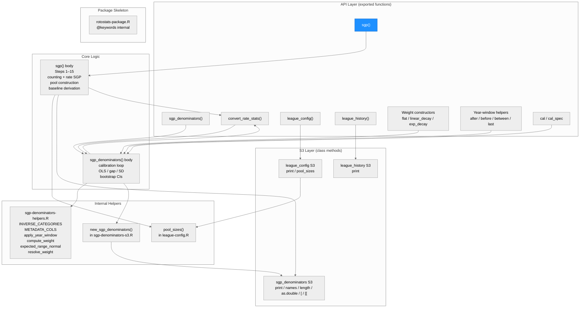
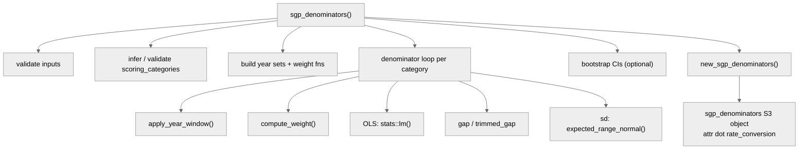
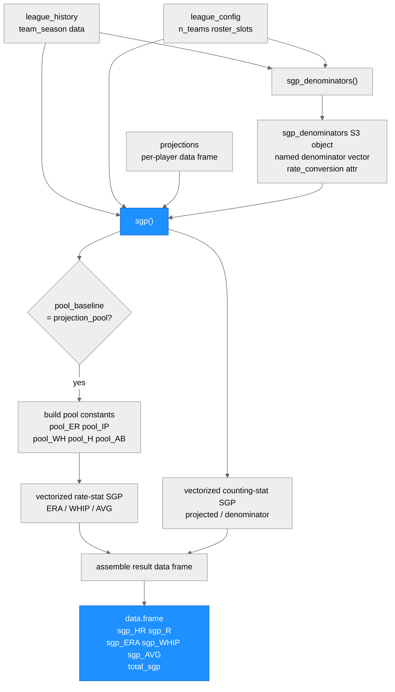

# Architecture: rotostats

**Run:** `sgp-2026-04-16`
**Branch:** `feature/sgp` @ `22b7f4b`
**Date:** 2026-04-16

---

## System Architecture

### Module Structure

### Function Call Graph

```mermaid
%%{init: {'theme': 'neutral'}}%%
graph TD
    A["sgp()"] --> B["Step 1: normalize column names"]
    A --> C["Step 2–5: validate rate_conversion"]
    A --> D["Step 6: validate league_history / config"]
    A --> E["Step 7: derive scored_cats"]
    A --> F["Step 8: warn missing columns"]
    A --> G["Step 9: handle SVHD"]
    A --> H["Step 10: baseline year + avg_ERA/WHIP/AVG"]
    A --> I["Step 11: pool constants"]
    A --> J["Steps 13–14: compute SGP columns"]
    A --> K["Step 15: assemble data frame"]

    C --> C1["cli_abort\nrotostats_error_invalid_rate_conversion"]
    C --> C2["cli_abort\nrotostats_error_not_implemented"]
    C --> C3["convert_rate_stats() — delegate"]

    D --> D1["cli_abort\nrotostats_error_missing_config_field"]
    D --> D2["cli_abort\nrotostats_error_missing_required_column"]

    F --> F1["cli_warn\nrotostats_warning_missing_category_column"]

    G --> G1["rlang::inform .frequency=once"]

    H --> H1["stats::weighted.mean ERA/WHIP"]
    H --> H2["stats::weighted.mean AVG"]
    H --> H3["cli_inform baseline year used"]

    I --> I1["pool_sizes(league_config)"]
    I --> I2["order + head — pitcher pool"]
    I --> I3["order + head — hitter pool"]

    J --> J1["vectorized division counting cats"]
    J --> J2["blended ERA formula vectorized"]
    J --> J3["blended WHIP formula vectorized"]
    J --> J4["blended AVG formula sign flip"]
    J --> J5["cli_warn zero IP/AB"]

    K --> K1["as.data.frame sgp_cols"]
    K --> K2["rowSums na.rm=FALSE"]

    style A fill:#1e90ff,stroke:#1565c0,color:#fff
    style J fill:#1e90ff,stroke:#1565c0,color:#fff
```

**sgp_denominators() call graph (for reference):**

### Data Flow

---

## Module Reference Table

| Module / Function | Purpose | Key Dependencies | Changed in This Run |
|---|---|---|---|
| `R/sgp.R` — `sgp()` | Per-player SGP converter; counting + blended-pool rate-stat methods | `sgp_denominators` S3, `pool_sizes()`, `convert_rate_stats()`, `cli`, `rlang`, `stats` | **YES** |
| `R/sgp-denominators.R` — `sgp_denominators()` | Calibrates per-category SGP denominators from league history | `sgp-denominators-helpers.R`, `sgp-denominators-s3.R`, `cli`, `stats` | No |
| `R/sgp-denominators.R` — `convert_rate_stats()` | Stub; always aborts with `rotostats_error_not_implemented` | `cli` | No |
| `R/sgp-denominators-s3.R` — `new_sgp_denominators()` | Constructor for `sgp_denominators` S3 object; sets `attr(., "rate_conversion")` | Base R | No |
| `R/sgp-denominators-s3.R` — S3 methods | `print`, `names`, `length`, `as.double`, `[`, `[[` for `sgp_denominators` | Base R | No |
| `R/sgp-denominators-helpers.R` | `INVERSE_CATEGORIES`, `METADATA_COLS`, weight helpers, year-window helpers, `expected_range_normal()` | `stats` | No |
| `R/league-config.R` — `league_config()` | Constructor for `league_config` S3 object; validates roster / budget config | `cli` | No |
| `R/league-config.R` — `pool_sizes()` | Returns `list(pitchers, hitters)` from config; used by `sgp()` for pool construction | `league_config` S3 | No |
| `R/league-history.R` — `league_history()` | Constructor for `league_history` S3 object; validates `team_season` schema | `cli` | No |
| `R/rotostats-package.R` | Package-level Rd stub and `@keywords internal` | — | No |

---

## Key Design Decisions (This Run)

1. **Blended-pool fixed-constant approximation**: Pool constants are computed once from the projected top-N players and applied to all evaluees. Each player is blended against the full pool (not pool-excluding-self). Approximation error is bounded at 5–15% for individual players but cancels in aggregate standings comparisons. Monte Carlo validation confirmed errors well under 1% in practice (SV-8).

2. **`attr(denominators, "rate_conversion")` on outer S3 object**: The compatibility check reads from the outer `sgp_denominators` object, not from `$denominators`. Reading the wrong level silently returns `NULL`, which would always pass the check spuriously. Verified correct in tester's EC-2 and EC-11a.

3. **`rotostats_warning_missing_category_column` dual use**: The same class covers "column absent from projections" (Step 8) and "player has 0 or NA playing time" (Steps 14a, 14d). Messages are distinguishable by content; one class makes it easy to suppress both with a single `withCallingHandlers` call.

4. **SVHD auto-derivation with `.frequency_id`**: `rlang::inform(.frequency = "once")` requires `.frequency_id` in rlang >= 1.1.0. The correct call uses `.frequency_id = "sgp_svhd_derivation"`. Omitting this caused a runtime crash (BLOCK-1 in tester round 1, fixed in builder round 2).

5. **`total_sgp` uses `na.rm = FALSE`**: Any per-category NA propagates to `total_sgp` to surface data quality issues downstream. Callers who want partial sums can compute `rowSums(result[, grep("^sgp_", names(result))], na.rm = TRUE)` themselves.
