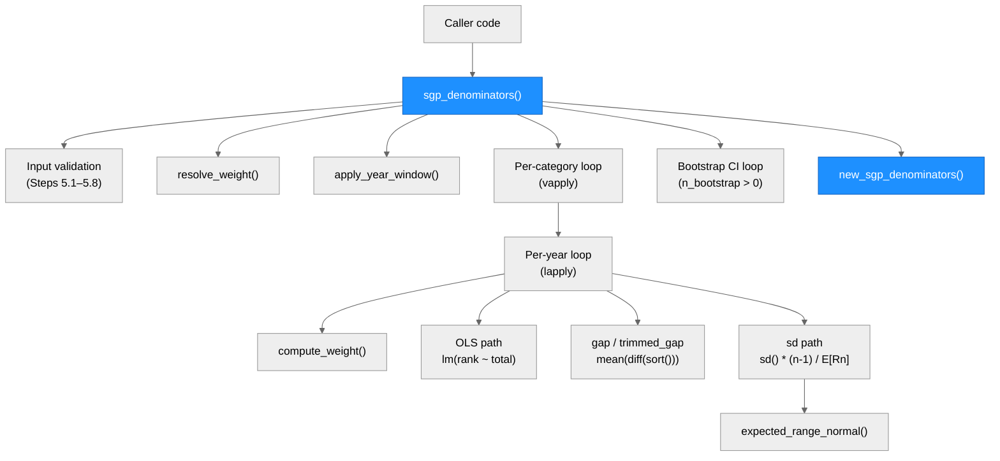
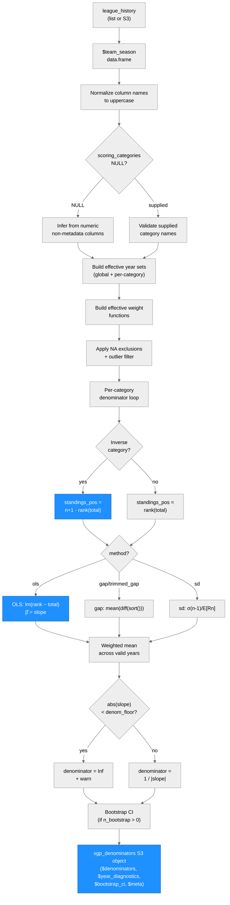

<!-- generated by Scriber — sgp-denominators-2026-04-16 -->
# rotostats Architecture

> **Run:** sgp-denominators-2026-04-16 | **Branch:** feature/sgp-denominators

---

## System Architecture

### Module Structure

```mermaid
%%{init: {'theme': 'neutral'}}%%
graph TD
  subgraph API["API Layer (Exported)"]
    SGP["sgp_denominators()"]
    CRS["convert_rate_stats() stub"]
    FLAT["flat()"]
    LINDEC["linear_decay()"]
    EXPDEC["exp_decay()"]
    AFTER["after()"]
    BEFORE["before()"]
    BETWEEN["between()"]
    LAST["last()"]
    CAL["cal()"]
    CALSPEC["cal_spec()"]
    ERN["expected_range_normal()"]
    S3["S3 methods (print / [ / [[ / as.double / names / length)"]
  end

  subgraph CORE["Core Logic (sgp-denominators.R)"]
    SGP
    CRS
    RW["resolve_weight()"]
  end

  subgraph HELPERS["Helpers (sgp-denominators-helpers.R)"]
    FLAT
    LINDEC
    EXPDEC
    AFTER
    BEFORE
    BETWEEN
    LAST
    CAL
    CALSPEC
    ERN
    AYW["apply_year_window()"]
    CW["compute_weight()"]
    VYW["is_valid_year_window()"]
    VW["is_valid_weight()"]
    CONSTS["INVERSE_CATEGORIES\nMETADATA_COLS"]
  end

  subgraph S3LAYER["S3 Layer (sgp-denominators-s3.R)"]
    CTOR["new_sgp_denominators()"]
    S3
  end

  SGP --> RW
  SGP --> AYW
  SGP --> CW
  SGP --> CTOR
  SGP --> ERN
  SGP --> CONSTS
  RW --> FLAT
  RW --> LINDEC
  CAL --> VYW
  CAL --> VW
  CALSPEC --> CAL
  CW --> LINDEC

  style SGP fill:#1e90ff,stroke:#1565c0,color:#fff
  style CRS fill:#1e90ff,stroke:#1565c0,color:#fff
  style S3 fill:#1e90ff,stroke:#1565c0,color:#fff
  style CTOR fill:#1e90ff,stroke:#1565c0,color:#fff
```

| Module | Purpose | Key Dependencies | Changed in This Run |
|--------|---------|-----------------|---------------------|
| `sgp_denominators()` | Main entry point: validates input, calibrates denominators | helpers, S3 layer | Yes — new |
| `convert_rate_stats()` | Stub; always aborts | — | Yes — new |
| `resolve_weight()` | Resolves string/class weight specs to callables | `flat()`, `linear_decay_weight` class | Yes — new |
| `flat()` | Equal-weight constructor | — | Yes — new |
| `linear_decay()` | Sentinel for linear-decay weighting | — | Yes — new |
| `exp_decay()` | Exponential-decay weight constructor | — | Yes — new |
| `after()` / `before()` / `between()` / `last()` | Year-window S3 constructors | — | Yes — new |
| `apply_year_window()` | Filters year vector by window spec | year-window classes | Yes — new |
| `compute_weight()` | Dispatches on weight class to compute a single weight | `linear_decay_weight` class | Yes — new |
| `cal()` | Single-category calibration override | `is_valid_year_window`, `is_valid_weight` | Yes — new |
| `cal_spec()` | Multi-category override collection | `cal()` | Yes — new |
| `expected_range_normal()` | E[range] of n standard normals via integration | `stats::integrate`, `stats::pnorm` | Yes — new |
| `new_sgp_denominators()` | S3 constructor | — | Yes — new |
| S3 methods | print / [ / [[ / as.double / names / length | `new_sgp_denominators()` | Yes — new |
| `INVERSE_CATEGORIES` | Constant: c("ERA", "WHIP") | — | Yes — new |
| `METADATA_COLS` | Constant: c("YEAR","TEAM_ID","IP","AB") | — | Yes — new |

---

### Function Call Graph

| Function | Purpose | Key Dependencies | Changed |
|----------|---------|-----------------|---------|
| `sgp_denominators()` | Orchestrates full pipeline | all helpers | Yes |
| Input validation (5.1–5.8) | Type/range checks, inference | `cli::cli_abort`, `cli::cli_warn` | Yes |
| `resolve_weight()` | Converts string/sentinel to weight fn | `flat()`, `linear_decay_weight` | Yes |
| `apply_year_window()` | Year-set filtering | S3 window classes | Yes |
| `compute_weight()` | Single-year weight computation | `linear_decay_weight` dispatch | Yes |
| Per-category loop | `vapply` over categories | per-year lapply | Yes |
| Per-year loop | `lapply` over years | OLS / gap / sd branches | Yes |
| OLS path | `lm()`, rank-flip for inverse cats | `stats::lm`, `INVERSE_CATEGORIES` | Yes |
| gap / trimmed_gap path | `diff(sort())` | — | Yes |
| sd path | `sd()`, `expected_range_normal()` | `stats::sd`, `stats::integrate` | Yes |
| Bootstrap CI loop | Year-level resample | mirrors main pipeline | Yes |
| `new_sgp_denominators()` | S3 construction | — | Yes |

---

### Data Flow

---

## Key Design Decisions

### 1. Direction-aware rank-flip for inverse categories

For ERA and WHIP, `rank(total)` gives rank 1 to the best (lowest) value, which
is the wrong convention. The implementation applies `n + 1 - rank(total)` so the
best team gets rank *n* and the OLS slope is negative (rank decreases as total
increases). Future S3 authors: add inverse categories to `INVERSE_CATEGORIES` in
`R/sgp-denominators-helpers.R`.

### 2. `as.double` vs `as.numeric` dispatch

`as.numeric` is a base primitive that does not dispatch S3 methods on list
objects. The method is registered as `as.double.sgp_denominators`; `as.numeric`
works via R's internal delegation from `as.numeric` to `as.double`. **Future
list-based S3 classes in this package should register coercions under
`as.double`, not `as.numeric`.**

### 3. OLS vs SD estimand

The `"ols"` denominator (`1/|β̂|`) and `"sd"` denominator
(`σ × (n-1) / E[R_n]`) target different quantities. For a 12-team league with
σ = 25 they differ by a factor of ≈ 12. Do not mix methods across categories in
a single league valuation run.

### 4. Bootstrap CI undercoverage (Jensen's inequality)

The OLS denominator has a small upward Jensen's-inequality bias (`E[1/|β̂|] >
1/E[|β̂|]`). The percentile bootstrap CI is centred on the biased estimate,
yielding ≈ 85% empirical coverage at nominal 95% when `n_years ≤ 6`. Documented
in `?sgp_denominators` Caveats section. BCa bootstrap is a planned enhancement.

---

*Generated by Scriber — rotostats sgp-denominators-2026-04-16*
